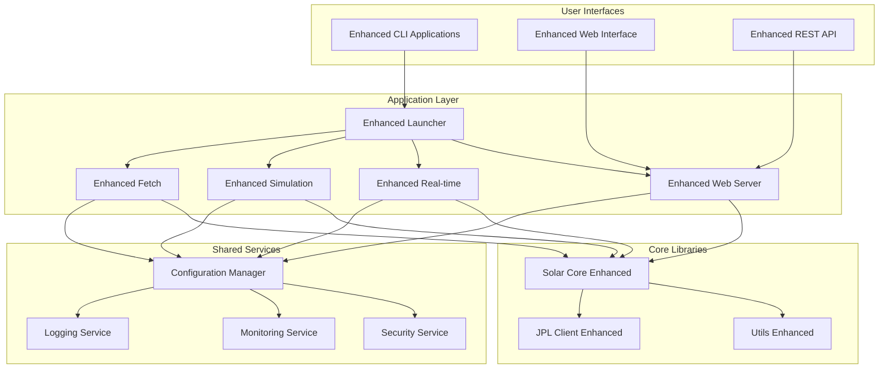
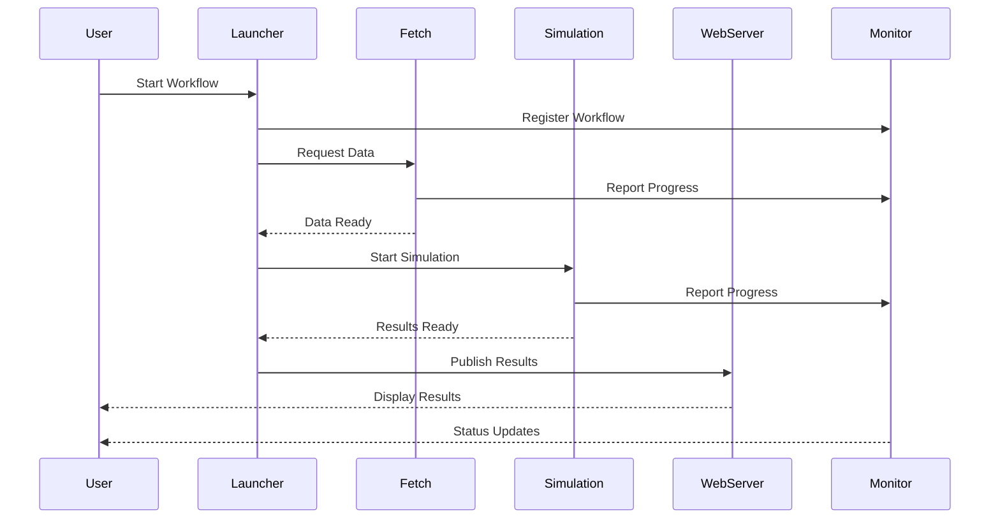

# Design Document - Application Enhancements

## Overview

This design document outlines the comprehensive enhancement of all Solar System Suite applications to transform them from basic implementations into robust, production-ready applications. The design emphasizes user experience, reliability, security, and maintainability while ensuring seamless integration between all suite components.

## Architecture

### Enhanced Application Architecture



### Application Communication Architecture



## Components and Interfaces

### 1. Enhanced Solar System Launcher

#### Core Enhancements
- **Workflow Orchestration**: Intelligent coordination of all suite components
- **Status Management**: Real-time status tracking and reporting
- **Error Recovery**: Comprehensive error handling with recovery strategies
- **Progress Tracking**: Detailed progress reporting for all operations

#### Interface Design
```cpp
class EnhancedLauncher {
public:
    // Workflow management
    [[nodiscard]] WorkflowResult execute_workflow(
        const WorkflowDefinition& workflow,
        const ProgressCallback& progress_cb = nullptr
    );

    // Component coordination
    [[nodiscard]] ComponentStatus check_component_status(
        ComponentType component
    ) const;

    // Error recovery
    [[nodiscard]] RecoveryResult attempt_recovery(
        const WorkflowError& error,
        RecoveryStrategy strategy = RecoveryStrategy::Auto
    );

    // Configuration management
    [[nodiscard]] ConfigurationResult load_configuration(
        const std::filesystem::path& config_path
    );
};
```

### 2. Enhanced Solar System Fetch Application

#### Core Enhancements
- **Intelligent Caching**: Multi-level cache management with validation
- **Network Resilience**: Robust network handling with retry mechanisms
- **Data Validation**: Comprehensive data integrity checking
- **Progress Reporting**: Detailed progress tracking for large operations

#### Interface Design
```cpp
class EnhancedFetchApplication {
public:
    // fetching with progress
    [[nodiscard]] FetchResult fetch_ephemeris_data(
        const FetchRequest& request,
        const ProgressCallback& progress_cb = nullptr
    );

    // Cache management
    [[nodiscard]] CacheResult manage_cache(
        CacheOperation operation,
        const CacheOptions& options = {}
    );

    // Data validation
    [[nodiscard]] ValidationResult validate_data(
        const EphemerisData& data,
        ValidationLevel level = ValidationLevel::Standard
    );

    // Network diagnostics
    [[nodiscard]] NetworkStatus check_network_connectivity() const;
};
```

### 3. Enhanced Solar System Simulation Application

#### Core Enhancements
- **Advanced Configuration**: Comprehensive parameter validation and management
- **Checkpointing**: Save and resume simulation state
- **Output Formatting**: Multiple output formats with metadata
- **Resource Monitoring**: Real-time resource usage tracking

#### Interface Design
```cpp
class EnhancedSimulationApplication {
public:
    // Simulation execution with checkpointing
    [[nodiscard]] SimulationResult run_simulation(
        const SimulationConfig& config,
        const CheckpointOptions& checkpoint_opts = {},
        const ProgressCallback& progress_cb = nullptr
    );

    // Configuration validation
    [[nodiscard]] ValidationResult validate_configuration(
        const SimulationConfig& config
    ) const;

    // Output formatting
    [[nodiscard]] FormatResult format_output(
        const SimulationResults& results,
        OutputFormat format,
        const FormatOptions& options = {}
    );

    // Resource monitoring
    [[nodiscard]] ResourceUsage get_resource_usage() const;
};
```

### 4. Enhanced Real-time Monitoring Application

#### Core Enhancements
- **Live Data Streaming**: Efficient real-time data updates
- **Visualization Modes**: Multiple display and output formats
- **Resource Efficiency**: Optimized for continuous operation
- **Connection Management**: Robust connection handling with reconnection

#### Interface Design
```cpp
class EnhancedRealtimeApplication {
public:
    // Real-time monitoring
    [[nodiscard]] MonitoringResult start_monitoring(
        const MonitoringConfig& config,
        const DataCallback& data_cb,
        const ErrorCallback& error_cb = nullptr
    );

    // Visualization management
    [[nodiscard]] VisualizationResult configure_visualization(
        const VisualizationConfig& config
    );

    // Connection management
    [[nodiscard]] ConnectionStatus check_connections() const;
    void reconnect_all();

    // Resource optimization
    void optimize_for_continuous_operation();
};
```

### 5. Enhanced Web Server Application

#### Core Enhancements
- **Security Hardening**: Comprehensive security measures
- **Performance Optimization**: Efficient request handling and caching
- **API Management**: RESTful API with proper versioning
- **Health Monitoring**: Comprehensive health checks and monitoring

#### Interface Design
```cpp
class EnhancedWebServer {
public:
    // Server lifecycle
    [[nodiscard]] ServerResult start_server(
        const ServerConfig& config
    );

    void stop_server(
        std::chrono::milliseconds graceful_timeout = std::chrono::seconds(30)
    );

    // Security management
    [[nodiscard]] SecurityResult configure_security(
        const SecurityConfig& config
    );

    // Health monitoring
    [[nodiscard]] HealthStatus get_health_status() const;

    // API management
    [[nodiscard]] APIResult register_api_endpoint(
        const std::string& path,
        const EndpointHandler& handler,
        const EndpointConfig& config = {}
    );
};
```

## Data Models

### Configuration Management

```cpp
struct ApplicationConfig {
    std::string application_name;
    std::string version;
    LoggingConfig logging;
    MonitoringConfig monitoring;
    SecurityConfig security;
    std::map<std::string, std::string> custom_settings;

    // Validation
    [[nodiscard]] ValidationResult validate() const;

    // Serialization
    [[nodiscard]] std::string to_json() const;
    [[nodiscard]] static ApplicationConfig from_json(const std::string& json);
};

struct WorkflowDefinition {
    std::string name;
    std::string description;
    std::vector<WorkflowStep> steps;
    std::map<std::string, std::string> parameters;
    std::chrono::seconds timeout;
    RetryPolicy retry_policy;
};
```

### Monitoring and Diagnostics

```cpp
struct ApplicationMetrics {
    std::chrono::system_clock::time_point timestamp;
    std::string application_name;

    // Performance metrics
    std::chrono::nanoseconds response_time;
    double cpu_usage_percent;
    size_t memory_usage_bytes;
    size_t disk_usage_bytes;

    // Application-specific metrics
    size_t active_connections;
    size_t processed_requests;
    size_t error_count;

    // Health indicators
    HealthStatus health_status;
    std::vector<std::string> warnings;
    std::vector<std::string> errors;
};

struct DiagnosticReport {
    std::chrono::system_clock::time_point generated_at;
    std::string application_name;
    std::string version;

    // System information
    SystemInfo system_info;

    // Application state
    ApplicationState current_state;
    std::vector<ApplicationMetrics> recent_metrics;

    // Error analysis
    std::vector<ErrorSummary> error_summaries;
    std::vector<std::string> recommendations;
};
```

### Security Models

```cpp
struct SecurityConfig {
    // Authentication
    AuthenticationMethod auth_method;
    std::chrono::seconds token_lifetime;

    // Authorization
    std::vector<Role> roles;
    std::vector<Permission> permissions;

    // Network security
    bool enable_tls;
    std::string certificate_path;
    std::string private_key_path;

    // Input validation
    InputValidationRules validation_rules;

    // Rate limiting
    RateLimitConfig rate_limits;
};

class SecurityManager {
public:
    // Authentication
    [[nodiscard]] AuthResult authenticate_user(
        const Credentials& credentials
    );

    // Authorization
    [[nodiscard]] bool authorize_action(
        const User& user,
        const Action& action,
        const Resource& resource
    ) const;

    // Input validation
    [[nodiscard]] ValidationResult validate_input(
        const std::string& input,
        InputType type
    ) const;

    // Security monitoring
    void log_security_event(const SecurityEvent& event);
};
```

## Error Handling

### Comprehensive Error Management

```cpp
enum class ApplicationErrorCode {
    // Configuration errors
    InvalidConfiguration,
    MissingConfiguration,
    ConfigurationConflict,

    // Runtime errors
    ResourceExhausted,
    ServiceUnavailable,
    NetworkError,

    // Security errors
    AuthenticationFailed,
    AuthorizationDenied,
    SecurityViolation,

    // Data errors
    DataCorrupted,
    DataNotFound,
    ValidationFailed
};

struct ApplicationError {
    ApplicationErrorCode code;
    std::string message;
    std::string context;
    std::vector<std::string> suggestions;
    ErrorSeverity severity;
    std::chrono::system_clock::time_point timestamp;
    std::optional<std::string> recovery_action;
};

class ErrorManager {
public:
    // Error reporting
    void report_error(const ApplicationError& error);

    // Error recovery
    [[nodiscard]] RecoveryResult attempt_recovery(
        const ApplicationError& error
    );

    // Error analysis
    [[nodiscard]] std::vector<ErrorPattern> analyze_error_patterns(
        std::chrono::hours analysis_window = std::chrono::hours(24)
    ) const;
};
```

## Testing Strategy

### Application Testing Framework

```cpp
class ApplicationTestFramework {
public:
    // Integration testing
    [[nodiscard]] TestResult test_application_integration(
        const ApplicationConfig& config
    );

    // Performance testing
    [[nodiscard]] PerformanceTestResult test_application_performance(
        const PerformanceTestConfig& config
    );

    // Security testing
    [[nodiscard]] SecurityTestResult test_application_security(
        const SecurityTestConfig& config
    );

    // Reliability testing
    [[nodiscard]] ReliabilityTestResult test_application_reliability(
        const ReliabilityTestConfig& config
    );
};
```

### Test Scenarios

1. **Functional Testing**
   - All application features work as specified
   - Error handling works correctly
   - Configuration management functions properly

2. **Integration Testing**
   - Applications communicate correctly
   - Data flows properly between components
   - Workflow orchestration functions correctly

3. **Performance Testing**
   - Applications meet performance requirements
   - Resource usage is within acceptable limits
   - Scalability requirements are met

4. **Security Testing**
   - Authentication and authorization work correctly
   - Input validation prevents security vulnerabilities
   - Network security measures are effective

5. **Reliability Testing**
   - Applications recover from failures gracefully
   - Error handling provides useful information
   - Monitoring and diagnostics work correctly

## Implementation Strategy

### Development Phases

#### Phase 1: Core Application Enhancement (Weeks 1-4)
- Enhance launcher with workflow orchestration
- Improve fetch application with robust caching
- Upgrade simulation application with checkpointing
- Complete real-time application with streaming

#### Phase 2: Web Server and API Enhancement (Weeks 5-6)
- Implement security hardening
- Add comprehensive API management
- Implement health monitoring
- Add performance optimization

#### Phase 3: Cross-Application Services (Weeks 7-8)
- Implement configuration management service
- Add comprehensive logging service
- Implement monitoring and diagnostics
- Add security service integration

#### Phase 4: Integration and Testing (Weeks 9-10)
- Comprehensive integration testing
- Performance and security testing
- Documentation and user guides
- Deployment and installation testing

### Quality Assurance

#### Code Quality Standards
- Comprehensive error handling for all code paths
- Security-first design and implementation
- Performance optimization and monitoring
- Comprehensive logging and diagnostics
- User-friendly interfaces and error messages

#### Testing Requirements
- 100% test coverage for all enhanced functionality
- Integration tests for all application interactions
- Performance tests with regression detection
- Security tests for all security features
- Reliability tests for error scenarios

#### Documentation Standards
- User guides for all applications
- API documentation for all interfaces
- Configuration guides and examples
- Troubleshooting and diagnostic guides
- Security and deployment guides
