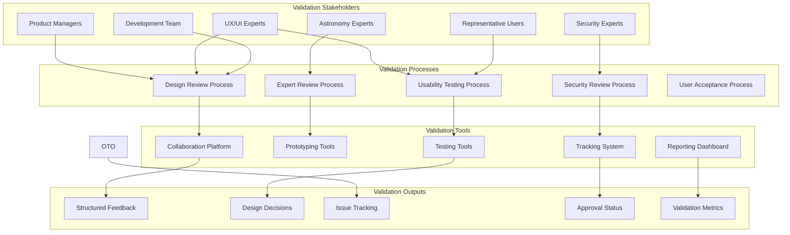
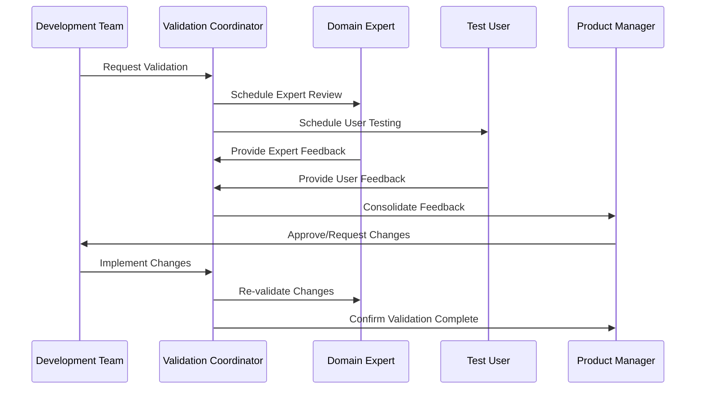
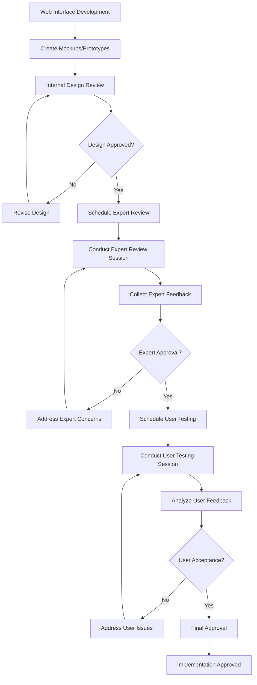
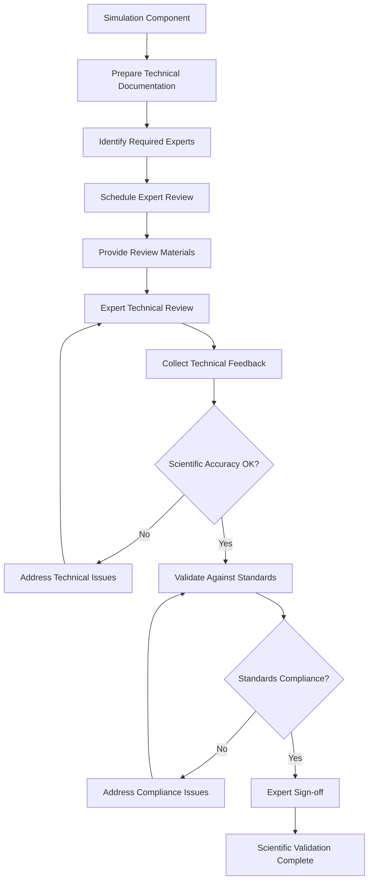
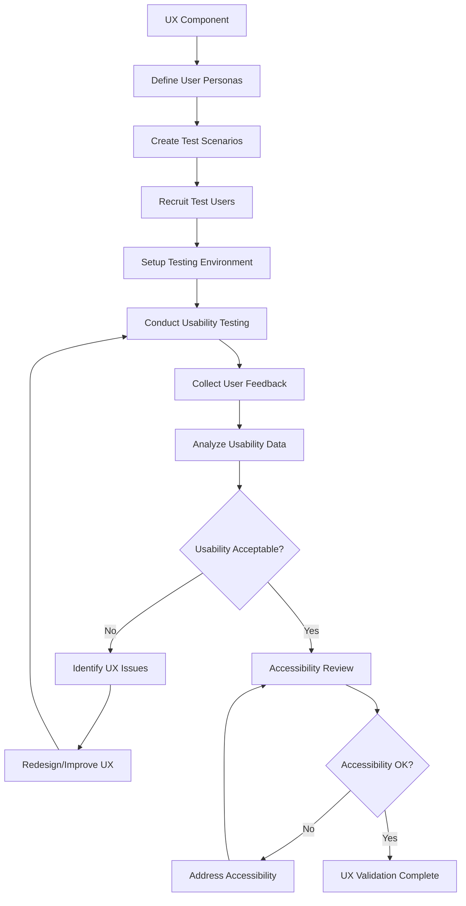

# Design Document - Collaborative Validation Framework

## Overview

This design document outlines the collaborative validation framework for the Solar System Suite, establishing structured processes for validating web server functionality, UI simulation components, and user experience elements through collaborative review, expert validation, and user testing.

## Architecture

### Collaborative Validation Architecture



### Validation Workflow Architecture



## Components and Interfaces

### 1. Validation Coordination System

#### Core Components
```cpp
class ValidationCoordinator {
public:
    // Validation session management
    [[nodiscard]] ValidationSession schedule_validation_session(
        const ValidationRequest& request,
        const std::vector<StakeholderType>& required_stakeholders
    );

    // Stakeholder coordination
    [[nodiscard]] StakeholderAvailability check_stakeholder_availability(
        const std::vector<StakeholderId>& stakeholders,
        const TimeRange& preferred_time
    );

    // Feedback collection and consolidation
    [[nodiscard]] ConsolidatedFeedback consolidate_feedback(
        const std::vector<ValidationFeedback>& feedback_items
    );

    // Validation tracking
    [[nodiscard]] ValidationStatus track_validation_progress(
        const ValidationSessionId& session_id
    );
};
```

### 2. Expert Review System

#### Domain Expert Integration
```cpp
class ExpertReviewSystem {
public:
    // Expert registration and management
    void register_domain_expert(
        const ExpertProfile& expert,
        const std::vector<ExpertiseDomain>& domains
    );

    // Review request routing
    [[nodiscard]] std::vector<ExpertId> find_appropriate_experts(
        const ReviewRequest& request
    );

    // Review session management
    [[nodiscard]] ExpertReviewSession create_expert_review_session(
        const ReviewMaterials& materials,
        const std::vector<ExpertId>& experts
    );

    // Expert feedback collection
    [[nodiscard]] ExpertFeedback collect_expert_feedback(
        const ExpertReviewSession& session
    );
};

struct ExpertProfile {
    std::string name;
    std::string email;
    std::vector<ExpertiseDomain> expertise_areas;
    AvailabilitySchedule availability;
    PreferredCommunicationMethods communication_preferences;
    ReviewHistory review_history;
};
```

### 3. User Testing Framework

#### User Testing Coordination
```cpp
class UserTestingFramework {
public:
    // User recruitment and management
    [[nodiscard]] std::vector<TestUserId> recruit_test_users(
        const UserPersona& target_persona,
        int required_count
    );

    // Testing session setup
    [[nodiscard]] UserTestingSession setup_testing_session(
        const TestingProtocol& protocol,
        const std::vector<TestUserId>& participants
    );

    // Usability testing execution
    [[nodiscard]] UsabilityTestResults conduct_usability_test(
        const UserTestingSession& session,
        const TestScenarios& scenarios
    );

    // User feedback analysis
    [[nodiscard]] UserFeedbackAnalysis analyze_user_feedback(
        const std::vector<UserFeedback>& feedback
    );
};

struct TestingProtocol {
    std::string protocol_name;
    std::vector<TestScenario> scenarios;
    std::vector<UsabilityMetric> metrics_to_collect;
    std::chrono::minutes session_duration;
    TestingEnvironment environment_requirements;
};
```

### 4. Validation Documentation System

#### Documentation and Tracking
```cpp
class ValidationDocumentationSystem {
public:
    // Session documentation
    void document_validation_session(
        const ValidationSession& session,
        const SessionOutcomes& outcomes
    );

    // Feedback tracking
    [[nodiscard]] FeedbackTrackingId track_feedback_item(
        const ValidationFeedback& feedback,
        const ImplementationPlan& plan
    );

    // Decision recording
    void record_validation_decision(
        const ValidationDecision& decision,
        const DecisionRationale& rationale
    );

    // Progress reporting
    [[nodiscard]] ValidationProgressReport generate_progress_report(
        const ProjectId& project,
        const TimeRange& reporting_period
    );
};
```

## Data Models

### Validation Request and Session Models

```cpp
struct ValidationRequest {
    std::string component_name;
    ValidationType validation_type;
    ValidationPriority priority;
    std::vector<ValidationCriteria> criteria;
    std::vector<StakeholderType> required_stakeholders;
    std::chrono::system_clock::time_point requested_completion;

    // Validation materials
    std::vector<ValidationArtifact> artifacts;
    std::string context_description;
    std::vector<std::string> specific_concerns;
};

struct ValidationSession {
    ValidationSessionId id;
    ValidationRequest request;
    std::vector<ParticipantId> participants;
    std::chrono::system_clock::time_point scheduled_time;
    std::chrono::minutes duration;

    // Session configuration
    SessionFormat format; // In-person, virtual, hybrid
    std::vector<ValidationTool> required_tools;
    ValidationEnvironment environment;

    // Session outcomes
    std::optional<SessionOutcomes> outcomes;
    ValidationStatus status;
};
```

### Feedback and Decision Models

```cpp
struct ValidationFeedback {
    FeedbackId id;
    ParticipantId participant;
    ValidationCriteria criteria;
    FeedbackType type; // Approval, concern, suggestion, question

    // Feedback content
    std::string summary;
    std::string detailed_description;
    FeedbackSeverity severity;
    std::vector<std::string> suggested_actions;

    // Supporting materials
    std::vector<FeedbackArtifact> supporting_materials;
    std::optional<std::string> reference_standards;
};

struct ValidationDecision {
    DecisionId id;
    ValidationSessionId session_id;
    std::string component_name;

    // Decision details
    DecisionType decision; // Approved, rejected, conditional_approval
    std::string rationale;
    std::vector<Condition> conditions; // For conditional approvals

    // Implementation requirements
    std::vector<RequiredChange> required_changes;
    std::chrono::system_clock::time_point implementation_deadline;
    bool requires_re_validation;
};
```

### Expert and User Models

```cpp
struct ExpertFeedback {
    ExpertId expert_id;
    ExpertiseDomain domain;
    std::string component_reviewed;

    // Technical assessment
    TechnicalAccuracy accuracy_assessment;
    std::vector<TechnicalConcern> technical_concerns;
    std::vector<TechnicalRecommendation> recommendations;

    // Compliance assessment
    std::vector<StandardsCompliance> standards_compliance;
    std::vector<BestPracticeRecommendation> best_practices;

    // Overall assessment
    ExpertApprovalStatus approval_status;
    std::string summary_assessment;
};

struct UserFeedback {
    TestUserId user_id;
    UserPersona persona;
    std::string component_tested;

    // Usability assessment
    UsabilityRating overall_usability;
    std::vector<UsabilityIssue> identified_issues;
    std::vector<UsabilityStrength> identified_strengths;

    // Task completion assessment
    std::vector<TaskCompletionResult> task_results;
    std::chrono::milliseconds average_task_time;
    int error_count;

    // Satisfaction assessment
    SatisfactionRating satisfaction;
    std::string qualitative_feedback;
    std::vector<ImprovementSuggestion> suggestions;
};
```

## Validation Processes

### 1. Web Interface Validation Process



### 2. Scientific Accuracy Validation Process



### 3. User Experience Validation Process



## Implementation Strategy

### Validation Framework Implementation

#### Phase 1: Infrastructure Setup (Week 1)
- Set up collaboration platforms and tools
- Establish stakeholder registry and contact systems
- Create validation request and tracking systems
- Implement basic documentation and reporting

#### Phase 2: Process Definition (Week 2)
- Define validation criteria and standards
- Create validation protocols and procedures
- Establish stakeholder roles and responsibilities
- Implement feedback collection and analysis systems

#### Phase 3: Stakeholder Onboarding (Week 3)
- Recruit and onboard domain experts
- Establish user testing participant pools
- Train validation coordinators and facilitators
- Conduct pilot validation sessions

#### Phase 4: Full Implementation (Week 4+)
- Begin regular validation sessions
- Implement continuous improvement processes
- Monitor validation effectiveness and efficiency
- Refine processes based on experience and feedback

### Quality Assurance

#### Validation Quality Standards
- All validation sessions must have clear objectives and success criteria
- Expert feedback must be documented and tracked through resolution
- User testing must follow established protocols and statistical validity
- Validation decisions must be documented with clear rationale
- Validation processes must be continuously improved based on effectiveness metrics

#### Success Metrics
- Validation session completion rate > 95%
- Expert feedback implementation rate > 90%
- User testing issue resolution rate > 85%
- Stakeholder satisfaction with validation process > 4.0/5.0
- Validation process efficiency improvement > 20% over 6 months
