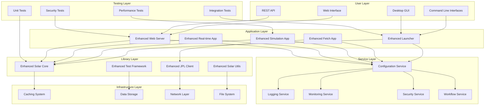
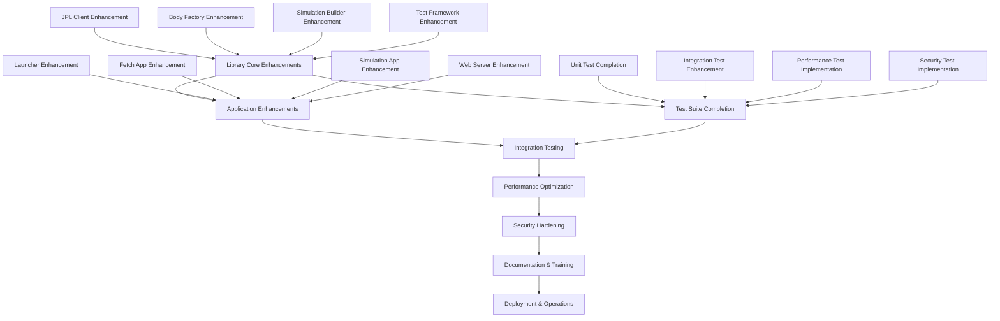
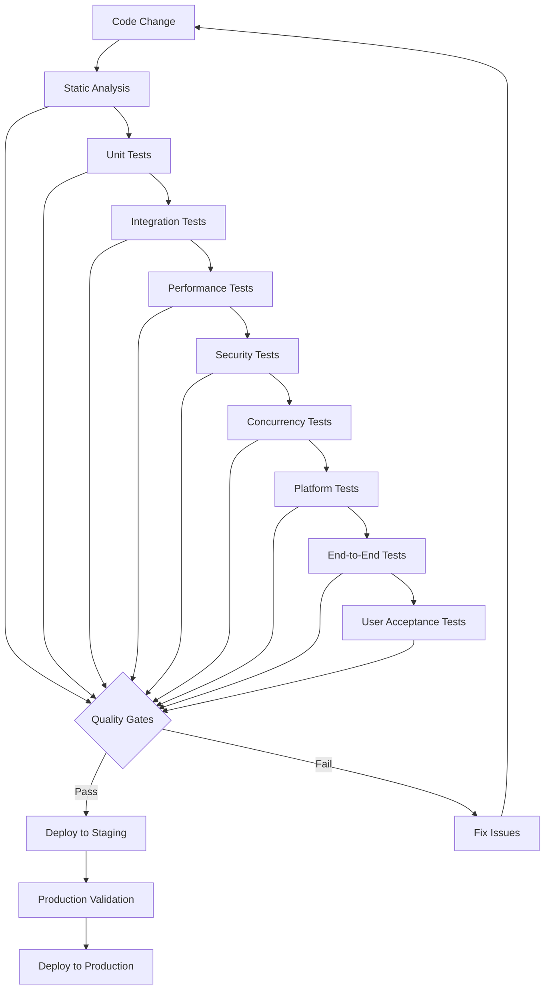

# Design Document - Comprehensive Implementation Roadmap

## Overview

This design document provides a unified architecture and implementation strategy for completing all stub implementations and enhancing all components of the Solar System Suite. It integrates library enhancements, application improvements, and test suite completion into a cohesive roadmap for achieving a fully functional, production-ready system.

## Architecture

### Comprehensive System Architecture



### Implementation Dependency Graph



## Components and Interfaces

### 1. Enhanced Library Layer

#### Core Library Enhancements
```cpp
namespace SolarSystem::Enhanced {

class ComprehensiveJPLClient : public JPL::JPLClient {
public:
    // Complete implementation replacing all placeholders
    [[nodiscard]] JPLResult<EphemerisData> fetch_with_comprehensive_validation(
        const FetchRequest& request,
        const ValidationOptions& validation = ValidationOptions::comprehensive()
    );

    // Advanced error handling and recovery
    [[nodiscard]] RecoveryResult attempt_intelligent_recovery(
        const JPLError& error,
        const RecoveryContext& context
    );

    // Performance monitoring and optimization
    [[nodiscard]] PerformanceMetrics get_performance_metrics() const;
    void optimize_for_usage_pattern(const UsagePattern& pattern);
};

class RobustBodyFactory : public Bodies::BodyFactory {
public:
    // Complete validation and error handling
    [[nodiscard]] ValidationResult validate_comprehensive(
        const BodyCreationRequest& request
    ) const;

    // Intelligent fallback strateg
    [[nodiscard]] Utils::Expected<CelestialBody, DetailedError> create_with_intelligent_fallback(
        const BodySpecification& spec,
        const FallbackStrategy& strategy = FallbackStrategy::adaptive()
    );

    // Resource management and optimization
    void optimize_memory_usage();
    [[nodiscard]] ResourceUsageReport get_resource_usage() const;
};

}
```

### 2. Enhanced Application Layer

#### Application Service Framework
```cpp
namespace SolarSystem::Applications {

class ApplicationFramework {
public:
    // Unified application lifecycle management
    [[nodiscard]] ApplicationResult initialize_application(
        const ApplicationConfig& config,
        const ServiceRegistry& services
    );

    // Cross-application communication
    [[nodiscard]] CommunicationResult establish_communication_channels(
        const std::vector<ApplicationEndpoint>& endpoints
    );

    // Comprehensive error handling
    void register_error_handler(
        const ErrorHandler& handler,
        ErrorSeverity min_severity = ErrorSeverity::Warning
    );

    // Performance monitoring
    [[nodiscard]] ApplicationMetrics collect_metrics() const;
};

class WorkflowOrchestrator {
public:
    // Complex workflow management
    [[nodiscard]] WorkflowResult execute_workflow(
        const WorkflowDefinition& workflow,
        const ExecutionContext& context
    );

    // Workflow monitoring and control
    [[nodiscard]] WorkflowStatus get_workflow_status(
        const WorkflowId& id
    ) const;

    void pause_workflow(const WorkflowId& id);
    void resume_workflow(const WorkflowId& id);
    void cancel_workflow(const WorkflowId& id);
};

}
```

### 3. Enhanced Testing Layer

#### Comprehensive Testing Framework
```cpp
namespace SolarSystem::Testing::Enhanced {

class ComprehensiveTestFramework {
public:
    // Multi-level test execution
    [[nodiscard]] TestSuiteResult execute_comprehensive_tests(
        const TestConfiguration& config
    );

    // Advanced test analysis
    [[nodiscard]] TestAnalysisReport analyze_test_results(
        const std::vector<TestResult>& results
    );

    // Performance regression detection
    [[nodiscard]] RegressionReport detect_performance_regressions(
        const PerformanceTestResults& current,
        const PerformanceBaseline& baseline
    );

    // Test optimization
    [[nodiscard]] OptimizationReport optimize_test_suite(
        const TestSuite& suite
    );
};

class IntelligentMockSystem {
public:
    // AI-powered mock generation
    template<typename Interface>
    [[nodiscard]] std::unique_ptr<MockObject<Interface>> generate_intelligent_mock(
        const MockGenerationOptions& options = {}
    );

    // Behavior learning and adaptation
    void learn_from_real_interactions(
        const std::vector<RealInteraction>& interactions
    );

    // Mock validation and verification
    [[nodiscard]] MockValidationResult validate_mock_behavior(
        const MockObject<Interface>& mock,
        const RealInterface& real_interface
    );
};

}
```

## Data Models

### Comprehensive Configuration Model

```cpp
struct ComprehensiveSystemConfig {
    // Application configurations
    std::map<std::string, ApplicationConfig> applications;

    // Service configurations
    ServiceConfig logging;
    ServiceConfig monitoring;
    ServiceConfig security;
    ServiceConfig workflow;

    // Performance configurations
    PerformanceConfig performance;

    // Testing configurations
    TestingConfig testing;

    // Deployment configurations
    DeploymentConfig deployment;

    // Validation and consistency checking
    [[nodiscard]] ValidationResult validate_comprehensive() const;
    [[nodiscard]] ConsistencyReport check_consistency() const;

    // Configuration migration and upgrade
    [[nodiscard]] MigrationResult migrate_from_version(
        const std::string& from_version
    );
};
```

### Enhanced Error and Diagnostic Models

```cpp
struct ComprehensiveError {
    // Error identification
    ErrorCode code;
    ErrorCategory category;
    ErrorSeverity severity;

    // Context information
    std::string component;
    std::string operation;
    std::string context;
    std::chrono::system_clock::time_point timestamp;

    // Diagnostic information
    std::string detailed_message;
    std::map<std::string, std::string> diagnostic_data;
    std::string stack_trace;

    // Recovery information
    std::vector<RecoveryAction> suggested_actions;
    std::optional<AutoRecoveryPlan> auto_recovery;

    // Related errors and patterns
    std::vector<ErrorId> related_errors;
    std::optional<ErrorPattern> pattern;
};

struct SystemHealthReport {
    std::chrono::system_clock::time_point generated_at;
    HealthStatus overall_status;

    // Component health
    std::map<std::string, ComponentHealth> component_health;

    // Performance metrics
    SystemPerformanceMetrics performance;

    // Resource usage
    SystemResourceUsage resources;

    // Error summary
    ErrorSummary recent_errors;

    // Recommendations
    std::vector<HealthRecommendation> recommendations;
};
```

## Error Handling

### Comprehensive Error Management Strategy

```cpp
class ComprehensiveErrorManager {
public:
    // Multi-level error handling
    void handle_error(
        const ComprehensiveError& error,
        const ErrorContext& context
    );

    // Error pattern analysis
    [[nodiscard]] std::vector<ErrorPattern> analyze_error_patterns(
        std::chrono::hours analysis_window = std::chrono::hours(24)
    ) const;

    // Predictive error detection
    [[nodiscard]] std::vector<PredictedError> predict_potential_errors(
        const SystemState& current_state
    ) const;

    // Automated error resolution
    [[nodiscard]] ResolutionResult attempt_automated_resolution(
        const ComprehensiveError& error
    );

    // Error prevention
    void implement_error_prevention_measures(
        const std::vector<ErrorPattern>& patterns
    );
};
```

## Testing Strategy

### Comprehensive Testing Approach



### Test Quality Metrics

```cpp
struct ComprehensiveTestMetrics {
    // Coverage metrics
    double code_coverage_percentage;
    double branch_coverage_percentage;
    double path_coverage_percentage;

    // Quality metrics
    double test_reliability_score;
    double test_maintainability_score;
    double test_performance_score;

    // Effectiveness metrics
    double defect_detection_rate;
    double regression_prevention_rate;
    double false_positive_rate;

    // Efficiency metrics
    std::chrono::milliseconds average_execution_time;
    double resource_utilization_efficiency;
    double maintenance_overhead_ratio;
};
```

## Implementation Strategy

### Phased Implementation Approach

#### Phase 1: Foundation (Weeks 1-4)
- Complete library core enhancements
- Implement comprehensive error handling
- Establish testing framework foundation
- Create configuration management system

#### Phase 2: Application Enhancement (Weeks 5-8)
- Enhance all applications with complete functionality
- Implement workflow orchestration
- Add comprehensive monitoring and diagnostics
- Create security hardening measures

#### Phase 3: Integration and Testing (Weeks 9-12)
- Complete test suite implementation
- Implement comprehensive integration testing
- Add performance testing and optimization
- Create security testing framework

#### Phase 4: Quality and Reliability (Weeks 13-16)
- Implement comprehensive quality assurance
- Add reliability and resilience testing
- Create comprehensive documentation
- Implement deployment and operations tools

#### Phase 5: Optimization and Finalization (Weeks 17-20)
- Performance optimization and tuning
- User experience improvements
- Final integration and validation
- Production readiness assessment

### Quality Assurance Strategy

#### Continuous Quality Monitoring
- Real-time code quality metrics
- Automated quality gate enforcement
- Continuous performance monitoring
- Automated security vulnerability scanning

#### Quality Improvement Process
- Regular quality reviews and assessments
- Continuous improvement based on metrics
- Proactive issue identification and resolution
- Knowledge sharing and best practice development

## Success Criteria

### Technical Success Criteria
- Zero placeholder implementations remaining
- 100% test coverage with meaningful tests
- All performance benchmarks met or exceeded
- Zero critical security vulnerabilities
- Complete documentation and user guides

### Quality Success Criteria
- System reliability > 99.9%
- Mean time to recovery < 5 minutes
- User satisfaction score > 4.5/5.0
- Developer productivity improvement > 25%
- Maintenance overhead reduction > 30%

### Business Success Criteria
- Successful production deployment
- User adoption and engagement targets met
- Performance and scalability requirements satisfied
- Security and compliance requirements met
- Total cost of ownership reduction achieved
