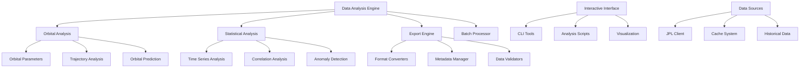

# Design Document

## Overview

The Data Analysis Tools will provide comprehensive scientific analysis capabilities for the Solar System Suite, enabling researchers to perform orbital mechanics calculations, statistical analysis, and data export for scientific research. The system will integrate with existing JPL data sources and provide both programmatic APIs and interactive tools.

## Architecture

### System Architecture



### Component Architecture

The data analysis tools will be implemented as a new application (`solar_system_analyzer`) with supporting libraries:

```
apps/solar_system_analyzer/
├── analyzer.cpp
├── CMakeLists.txt
└── analysis_config.hpp

lib/solar_analysis/
├── include/solar_analysis/
│   ├── core/
│   │   ├── analysis_engine.hpp
│   │   ├── data_processor.hpp
│   │   └── result_formatter.hpp
│   ├── orbital/
│   │   ├── orbital_calculator.hpp
│   │   ├── trajectory_analyzer.hpp
│   │   └── orbital_elements.hpp
│   ├── statistics/
│   │   ├── statistical_analyzer.hpp
│   │   ├── time_series_analyzer.hpp
│   │   └── correlation_analyzer.hpp
│   ├── export/
│   │   ├── data_exporter.hpp
│   │   ├── format_converter.hpp
│   │   └── metadata_manager.hpp
│   └── interactive/
│       ├── cli_interface.hpp
│       ├── script_engine.hpp
│       └── visualization.hpp
└── src/
    ├── core/
    ├── orbital/
    ├── statistics/
    ├── export/
    └── interactive/
```

## Components and Interfaces

### Analysis Engine Core

```cpp
class AnalysisEngine {
public:
    struct Configuration {
        std::string data_source_path = "./cache";
        std::vector<std::string> target_bodies;
        std::chrono::system_clock::time_point start_time;
        std::chrono::system_clock::time_point end_time;
        std::chrono::seconds time_step = std::chrono::hours(1);
        bool enable_caching = true;
        size_t max_memory_usage_mb = 4096;
    };

    explicit AnalysisEngine(Configuration config);

    // Data loading and preparation
    [[nodiscard]] AnalysisResult load_ephemeris_data(const std::vector<std::string>& body_names,
                                                     const TimeRange& time_range);
    [[nodiscard]] AnalysisResult prepare_dataset(const DatasetConfiguration& config);

    // Analysis execution
    [[nodiscard]] AnalysisResult perform_orbital_analysis(const OrbitalAnalysisRequest& request);
    [[nodiscard]] AnalysisResult perform_statistical_analysis(const StatisticalAnalysisRequest& request);
    [[nodiscard]] AnalysisResult perform_trajectory_analysis(const TrajectoryAnalysisRequest& request);

    // Batch processing
    [[nodiscard]] BatchResult process_batch_analysis(const BatchConfiguration& config);
    void set_progress_callback(std::function<void(double)> callback);

private:
    Configuration config_;
    std::unique_ptr<DataProcessor> data_processor_;
    std::unique_ptr<OrbitalCalculator> orbital_calculator_;
    std::unique_ptr<StatisticalAnalyzer> statistical_analyzer_;
};
```

### Orbital Analysis Components

```cpp
struct OrbitalElements {
    double semi_major_axis;          // km
    double eccentricity;             // dimensionless
    double inclination;              // radians
    double longitude_of_ascending_node;  // radians
    double argument_of_periapsis;    // radians
    double mean_anomaly;             // radians
    double orbital_period;           // seconds
    std::chrono::system_clock::time_point epoch;

    [[nodiscard]] double periapsis_distance() const;
    [[nodiscard]] double apoapsis_distance() const;
    [[nodiscard]] double mean_motion() const;
    [[nodiscard]] std::string to_string() const;
};

class OrbitalCalculator {
public:
    // Orbital element calculation
    [[nodiscard]] OrbitalElements calculate_orbital_elements(
        const std::vector<StateVector>& position_velocity_data) const;

    [[nodiscard]] std::vector<OrbitalElements> calculate_elements_over_time(
        const std::vector<StateVector>& data,
        std::chrono::seconds interval) const;

    // Orbital predictions
    [[nodiscard]] StateVector predict_position(const OrbitalElements& elements,
                                              std::chrono::system_clock::time_point target_time) const;

    [[nodiscard]] std::vector<StateVector> generate_orbital_trajectory(
        const OrbitalElements& elements,
        const TimeRange& time_range,
        std::chrono::seconds time_step) const;

    // Orbital analysis
    [[nodiscard]] double calculate_orbital_velocity(const OrbitalElements& elements,
                                                   double true_anomaly) const;

    [[nodiscard]] std::vector<double> calculate_velocity_profile(
        const OrbitalElements& elements,
        size_t num_points = 360) const;

    // Perturbation analysis
    [[nodiscard]] OrbitalPerturbations analyze_perturbations(
        const std::vector<OrbitalElements>& elements_over_time) const;

priva
// Internal calculation methods
    [[nodiscard]] double solve_kepler_equation(double mean_anomaly, double eccentricity) const;
    [[nodiscard]] Vector3 calculate_position_in_orbital_plane(const OrbitalElements& elements,
                                                             double true_anomaly) const;
};

class TrajectoryAnalyzer {
public:
    struct TrajectoryAnalysis {
        std::string spacecraft_name;
        std::vector<StateVector> trajectory_points;
        std::vector<ManeuverPoint> maneuvers;
        double total_delta_v;
        std::vector<EncounterEvent> encounters;
        TrajectoryStatistics statistics;
    };

    struct ManeuverPoint {
        std::chrono::system_clock::time_point time;
        Vector3 delta_v;
        std::string description;
        double fuel_cost;
    };

    struct EncounterEvent {
        std::chrono::system_clock::time_point time;
        std::string target_body;
        double closest_approach_distance;
        double relative_velocity;
        Vector3 encounter_geometry;
    };

    // Trajectory analysis
    [[nodiscard]] TrajectoryAnalysis analyze_spacecraft_trajectory(
        const std::string& spacecraft_name,
        const TimeRange& analysis_period) const;

    [[nodiscard]] std::vector<EncounterEvent> find_close_approaches(
        const std::vector<StateVector>& trajectory,
        const std::vector<StateVector>& target_trajectory,
        double threshold_distance) const;

    // Mission planning
    [[nodiscard]] std::vector<ManeuverPoint> optimize_transfer_trajectory(
        const StateVector& initial_state,
        const StateVector& target_state,
        const TimeRange& transfer_window) const;

    [[nodiscard]] double calculate_delta_v_requirement(
        const StateVector& current_state,
        const StateVector& target_state) const;
};
```

### Statistical Analysis Components

```cpp
class StatisticalAnalyzer {
public:
    struct StatisticalSummary {
        double mean;
        double median;
        double standard_deviation;
        double variance;
        double minimum;
        double maximum;
        double skewness;
        double kurtosis;
        size_t sample_count;
    };

    struct CorrelationMatrix {
        std::vector<std::string> variable_names;
        std::vector<std::vector<double>> correlation_coefficients;
        std::vector<std::vector<double>> p_values;
    };

    // Basic statistics
    [[nodiscard]] StatisticalSummary calculate_summary_statistics(
        const std::vector<double>& data) const;

    [[nodiscard]] std::map<std::string, StatisticalSummary> analyze_position_statistics(
        const std::map<std::string, std::vector<StateVector>>& body_data) const;

    // Correlation analysis
    [[nodiscard]] CorrelationMatrix calculate_correlation_matrix(
        const std::map<std::string, std::vector<double>>& variables) const;

    [[nodiscard]] double calculate_cross_correlation(
        const std::vector<double>& series1,
        const std::vector<double>& series2,
        int lag = 0) const;

    // Time series analysis
    [[nodiscard]] TimeSeriesAnalysis analyze_time_series(
        const std::vector<TimestampedValue>& time_series) const;

    [[nodiscard]] std::vector<double> detect_trend(
        const std::vector<TimestampedValue>& time_series) const;

    [[nodiscard]] std::vector<SeasonalComponent> detect_seasonality(
        const std::vector<TimestampedValue>& time_series) const;

    // Anomaly detection
    [[nodiscard]] std::vector<AnomalyPoint> detect_anomalies(
        const std::vector<double>& data,
        double threshold_sigma = 3.0) const;

    [[nodiscard]] std::vector<AnomalyPoint> detect_orbital_anomalies(
        const std::vector<OrbitalElements>& orbital_data) const;
};

class TimeSeriesAnalyzer {
public:
    struct TimeSeriesAnalysis {
        TrendAnalysis trend;
        SeasonalAnalysis seasonality;
        std::vector<AnomalyPoint> anomalies;
        ForecastResult forecast;
        StatisticalSummary statistics;
    };

    struct TrendAnalysis {
        double slope;
        double intercept;
        double r_squared;
        double p_value;
        TrendDirection direction;
        double trend_strength;
    };

    // Time series decomposition
    [[nodiscard]] TimeSeriesAnalysis decompose_time_series(
        const std::vector<TimestampedValue>& data) const;

    // Forecasting
    [[nodiscard]] ForecastResult forecast_values(
        const std::vector<TimestampedValue>& historical_data,
        size_t forecast_periods) const;

    // Change point detection
    [[nodiscard]] std::vector<ChangePoint> detect_change_points(
        const std::vector<TimestampedValue>& data) const;
};
```

### Data Export System

```cpp
class DataExporter {
public:
    enum class ExportFormat {
        CSV,
        JSON,
        XML,
        HDF5,
        FITS,
        NetCDF,
        Parquet
    };

    struct ExportConfiguration {
        ExportFormat format;
        std::string output_path;
        bool include_metadata = true;
        bool compress_output = false;
        std::string compression_algorithm = "gzip";
        std::map<std::string, std::string> custom_attributes;
    };

    explicit DataExporter(ExportConfiguration config);

    // Data export methods
    [[nodiscard]] ExportResult export_ephemeris_data(
        const std::map<std::string, std::vector<StateVector>>& data) const;

    [[nodiscard]] ExportResult export_orbital_elements(
        const std::map<std::string, std::vector<OrbitalElements>>& data) const;

    [[nodiscard]] ExportResult export_analysis_results(
        const AnalysisResult& results) const;

    [[nodiscard]] ExportResult export_statistical_summary(
        const std::map<std::string, StatisticalSummary>& summaries) const;

    // Batch export
    [[nodiscard]] BatchExportResult export_batch_data(
        const std::vector<ExportRequest>& requests) const;

    // Progress monitoring
    void set_progress_callback(std::function<void(double, const std::string&)> callback);

private:
    ExportConfiguration config_;
    std::unique_ptr<FormatConverter> format_converter_;
    std::unique_ptr<MetadataManager> metadata_manager_;
};

class FormatConverter {
public:
    // Format-specific converters
    [[nodiscard]] std::string to_csv(const DataTable& data) const;
    [[nodiscard]] std::string to_json(const DataTable& data) const;
    [[nodiscard]] std::string to_xml(const DataTable& data) const;

    // Binary format converters
    [[nodiscard]] BinaryData to_hdf5(const DataTable& data) const;
    [[nodiscard]] BinaryData to_fits(const DataTable& data) const;
    [[nodiscard]] BinaryData to_netcdf(const DataTable& data) const;

    // Metadata handling
    void add_metadata(const std::string& key, const std::string& value);
    void add_units_information(const std::map<std::string, std::string>& units);
    void add_reference_frame_info(const ReferenceFrameInfo& frame_info);
};
```

### Interactive Analysis Interface

```cpp
class InteractiveAnalyzer {
public:
    struct InteractiveSession {
        std::string session_id;
        std::map<std::string, std::any> variables;
        std::vector<std::string> command_history;
        std::chrono::system_clock::time_point created_at;
    };

    explicit InteractiveAnalyzer(std::shared_ptr<AnalysisEngine> engine);

    // Interactive session management
    [[nodiscard]] std::string create_session();
    void destroy_session(const std::string& session_id);
    [[nodiscard]] InteractiveSession& get_session(const std::string& session_id);

    // Command execution
    [[nodiscard]] CommandResult execute_command(const std::string& session_id,
                                               const std::string& command);

    [[nodiscard]] CommandResult execute_script(const std::string& session_id,
                                              const std::string& script_path);

    // Data manipulation
    [[nodiscard]] CommandResult load_data(const std::string& session_id,
                                         const std::string& data_source);

    [[nodiscard]] CommandResult filter_data(const std::string& session_id,
                                           const std::string& filter_expression);

    // Analysis commands
    [[nodiscard]] CommandResult analyze_orbits(const std::string& session_id,
                                              const std::vector<std::string>& body_names);

    [[nodiscard]] CommandResult calculate_statistics(const std::string& session_id,
                                                    const std::string& variable_name);

    // Visualization
    [[nodiscard]] CommandResult create_plot(const std::string& session_id,
                                           const PlotConfiguration& config);

    [[nodiscard]] CommandResult export_results(const std::string& session_id,
                                              const ExportConfiguration& config);

private:
    std::shared_ptr<AnalysisEngine> engine_;
    std::map<std::string, InteractiveSession> sessions_;
    std::unique_ptr<ScriptEngine> script_engine_;
    std::unique_ptr<VisualizationEngine> visualization_engine_;
};

class CLIInterface {
public:
    explicit CLIInterface(std::shared_ptr<InteractiveAnalyzer> analyzer);

    // CLI lifecycle
    void start_interactive_mode();
    void execute_batch_commands(const std::vector<std::string>& commands);
    void execute_script_file(const std::string& script_path);

    // Command processing
    void register_command(const std::string& name,
                         std::function<CommandResult(const std::vector<std::string>&)> handler);

    // Built-in commands
    CommandResult help_command(const std::vector<std::string>& args);
    CommandResult load_command(const std::vector<std::string>& args);
    CommandResult analyze_command(const std::vector<std::string>& args);
    CommandResult export_command(const std::vector<std::string>& args);
    CommandResult plot_command(const std::vector<std::string>& args);
    CommandResult quit_command(const std::vector<std::string>& args);

private:
    std::shared_ptr<InteractiveAnalyzer> analyzer_;
    std::string current_session_id_;
    std::map<std::string, std::function<CommandResult(const std::vector<std::string>&)>> commands_;
};
```

## Data Models

### Analysis Data Structures

```cpp
struct StateVector {
    std::chrono::system_clock::time_point timestamp;
    Vector3 position;  // km
    Vector3 velocity;  // km/s
    std::string reference_frame = "J2000_ECLIPTIC";

    [[nodiscard]] double speed() const;
    [[nodiscard]] double distance_from_origin() const;
    [[nodiscard]] std::string to_string() const;
};

struct TimestampedValue {
    std::chrono::system_clock::time_point timestamp;
    double value;
    std::string unit;
    std::map<std::string, std::string> metadata;
};

struct AnalysisResult {
    std::string analysis_type;
    std::string target_body;
    TimeRange analysis_period;
    std::map<std::string, std::any> results;
    std::vector<std::string> warnings;
    std::vector<std::string> errors;
    std::chrono::milliseconds execution_time;

    template<typename T>
    [[nodiscard]] std::optional<T> get_result(const std::string& key) const;

    [[nodiscard]] bool has_errors() const;
    [[nodiscard]] std::string to_json() const;
};
```

## Error Handling

The data analysis system will use structured error handling:

```cpp
enum class AnalysisError {
    DataLoadingFailed,
    InsufficientData,
    InvalidTimeRange,
    CalculationFailed,
    ExportFailed,
    InvalidConfiguration,
    MemoryExhausted,
    ScriptExecutionFailed
};

template<typename T>
using AnalysisResult = Expected<T, AnalysisError>;
```

## Testing Strategy

### Unit Tests
- Test individual analysis algorithms
- Validate orbital calculations against known values
- Test statistical calculations with synthetic data
- Verify export format correctness

### Integration Tests
- Test complete analysis workflows
- Validate data pipeline from JPL to analysis results
- Test interactive session management
- Verify batch processing capabilities

### Performance Tests
- Benchmark analysis performance with large datasets
- Test memory usage with long time series
- Validate export performance with various formats
- Test concurrent analysis operations

## Implementation Phases

### Phase 1: Core Analysis Engine
- Implement AnalysisEngine and DataProcessor
- Create basic orbital calculations
- Set up data loading from existing JPL sources
- Implement basic statistical analysis

### Phase 2: Advanced Analysis
- Add trajectory analysis capabilities
- Implement time series analysis
- Create anomaly detection algorithms
- Add correlation analysis

### Phase 3: Export and Visualization
- Implement data export in multiple formats
- Create visualization capabilities
- Add metadata management
- Build progress monitoring

### Phase 4: Interactive Interface
- Create CLI interface for interactive analysis
- Implement script execution engine
- Add session management
- Create comprehensive help system
