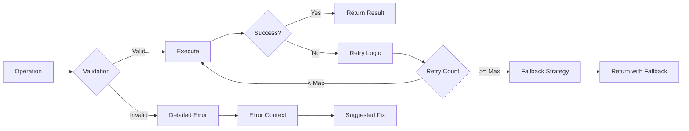

# Design Document - Library Core Enhancements

## Overview

This design document outlines the comprehensive enhancement of core library implementations in the Solar System Suite. The design focuses on replacing placeholder implementations with robust, production-ready code while maintaining backward compatibility and improving error handling, validation, and resource management.

## Architecture

### Enhanced Component Architecture

```mermaid
graph TB
    subgraph "Core Libraries"
        JPL[JPL Client Enhanced]
        BF[Body Factory Enhanced]
        BC[Body Collection Enhanced]
        SB[Simulation Builder Enhanced]
    end

    subgraph "Testing Framework"
        TF[Test Framework Enhanced]
        TDM[Test Data Manager Enhanced]
        TR[Test Reporters Enhanced]
    end

    subgraph "Utilities"
        AP[Argument Parser Enhanced]
        RM[Resource Manager]
        EM[Error Manager]
    end

    JPL --> BF
    BF --> BC
    BC --> SB
    TF --> TDM
    TDM --> TR
    AP --> RM
    RM --> EM
```



### Error Handling Strategy



## Components and Interfaces

### 1. Enhanced JPL Client

#### Core Enhancements
- **Robust Parsing**: Replace placeholder coordinate extraction with comprehensive JPL response parsing
- **Advanced Caching**: Implement multi-level cache validation with integrity checking
- **Network Resilience**: Add exponential backoff retry mechanisms
- **Error Context**: Provide detailed error information with recovery suggestions

#### Interface Extensions
```cpp
class EnhancedJPLClient : public JPLClient {
public:
    // Enhanced parsing with detailed error reporting
    [[nodiscard]] JPLResult<EphemerisCoordinates> parse_coordinates_detailed(
        const std::string& response,
        ValidationLevel level = ValidationLevel::Standard
    );

    // Advanced cache validation
    [[nodiscard]] CacheValidationResult validate_cache_comprehensive(
        const std::filesystem::path& cache_path
    );

    // Network resilience
    [[nodiscard]] JPLResult<std::string> fetch_with_resilience(
        const std::string& url,
        const RetryPolicy& policy = RetryPolicy::default_policy()
    );
};
```

### 2. Enhanced Body Factory and Collection

#### Body Factory Enhancements
- **Physical Validation**: Implement comprehensive physical property validation
- **Intelligent Fallbacks**: Add smart fallback strategies for missing data
- **Data Source Management**: Enhanced data source prioritization and validation

#### Body Collection Enhancements
- **Consistency Management**: Automatic consistency checking and maintenance
- **Efficient Operations**: Optimized collection operations with proper error handling
- **Relationship Tracking**: Enhanced body relationship and dependency tracking

#### Interface Extensions
```cpp
class EnhancedBodyFactory : public BodyFactory {
public:
    // Physical validation
    [[nodiscard]] ValidationResult validate_physical_properties(
        const CelestialBodyData& data
    ) const;

    // Intelligent fallback
    [[nodiscard]] Utils::Expected<CelestialBody, DetailedError> create_with_fallback(
        std::string_view name,
        const FallbackStrategy& strategy = FallbackStrategy::intelligent()
    ) const;
};

class EnhancedBodyCollection : public BodyCollection {
public:
    // Consistency management
    [[nodiscard]] ConsistencyReport check_consistency() const;
    void maintain_consistency();

    // Enhanced operations
    [[nodiscard]] OperationResult add_body_validated(
        const CelestialBody& body,
        ValidationLevel level = ValidationLevel::Standard
    );
};
```

### 3. Enhanced Simulation Builder

#### Core Enhancements
- **Comprehensive Validation**: Multi-level parameter validation with detailed error reporting
- **Configuration Management**: Advanced configuration validation and conflict detection
- **Date Handling**: Robust date parsing with multiple format support

#### Interface Extensions
```cpp
class EnhancedSimulationBuilder : public SimulationBuilder {
public:
    // Comprehensive validation
    [[nodiscard]] ValidationResult validate_comprehensive(
        ValidationLevel level = ValidationLevel::Strict
    ) const;

    // Configuration conflict detection
    [[nodiscard]] ConflictReport detect_conflicts() const;

    // Enhanced date parsing
    [[nodiscard]] Utils::Expected<std::chrono::system_clock::time_point, DateParseError>
    parse_date_flexible(const std::string& date_str) const;
};
```

### 4. Enhanced Test Framework

#### Memory and Performance Monitoring
- **Platform-Specific Measurement**: Implement OS-specific memory and performance measurement
- **Resource Tracking**: Comprehensive resource usage tracking
- **Regression Detection**: Advanced performance regression detection

#### Interface Extensions
```cpp
class EnhancedTestFramework {
public:
    // Platform-specific memory measurement
    [[nodiscard]] MemoryUsage measure_memory_usage() const;

    // Performance monitoring
    [[nodiscard]] PerformanceMetrics collect_performance_metrics(
        const TestExecution& execution
    ) const;

    // Regression detection
    [[nodiscard]] RegressionReport detect_performance_regression(
        const PerformanceMetrics& current,
        const PerformanceBaseline& baseline
    ) const;
};
```

### 5. Enhanced Argument Parser

#### Validation Enhancements
- **Multi-Format Support**: Support for various date, time, and numeric formats
- **Intelligent Suggestions**: Smart error messages with suggested corrections
- **Conflict Resolution**: Automatic detection and resolution of argument conflicts

#### Interface Extensions
```cpp
class EnhancedArgumentParser : public ArgumentParser {
public:
    // Enhanced validation
    [[nodiscard]] ValidationResult validate_with_suggestions(
        const std::vector<std::string>& args
    ) const;

    // Conflict detection
    [[nodiscard]] ConflictReport detect_argument_conflicts(
        const ParsedArguments& args
    ) const;

    // Smart suggestions
    [[nodiscard]] std::vector<std::string> suggest_corrections(
        const std::string& invalid_arg
    ) const;
};
```

## Data Models

### Enhanced Error Reporting

```cpp
struct DetailedError {
    ErrorCode code;
    std::string message;
    std::string context;
    std::vector<std::string> suggestions;
    std::optional<std::string> recovery_action;
    ErrorSeverity severity;
    std::chrono::system_clock::time_point timestamp;
};

struct ValidationResult {
    bool is_valid;
    std::vector<DetailedError> errors;
    std::vector<DetailedError> warnings;
    ValidationLevel level_used;
    std::optional<std::string> summary;
};
```

### Performance Monitoring Models

```cpp
struct MemoryUsage {
    size_t resident_set_size;
    size_t virtual_memory_size;
    size_t heap_usage;
    size_t stack_usage;
    std::chrono::system_clock::time_point measured_at;
};

struct PerformanceMetrics {
    std::chrono::nanoseconds execution_time;
    MemoryUsage peak_memory;
    size_t cpu_cycles;
    size_t cache_misses;
    double cpu_utilization;
};
```

### Resource Management Models

```cpp
class ResourceManager {
public:
    // RAII resource management
    template<typename Resource>
    class ManagedResource {
    public:
        explicit ManagedResource(Resource&& resource);
        ~ManagedResource();

        // Non-copyable, movable
        ManagedResource(const ManagedResource&) = delete;
        ManagedResource& operator=(const ManagedResource&) = delete;
        ManagedResource(ManagedResource&&) = default;
        ManagedResource& operator=(ManagedResource&&) = default;

        [[nodiscard]] Resource& get() { return resource_; }
        [[nodiscard]] const Resource& get() const { return resource_; }

    private:
        Resource resource_;
        std::function<void(Resource&)> cleanup_function_;
    };
};
```

## Error Handling

### Comprehensive Error Strategy

1. **Validation Errors**: Detailed validation with specific error codes and suggestions
2. **Runtime Errors**: Contextual error information with recovery strategies
3. **Resource Errors**: Proper resource cleanup with fallback mechanisms
4. **Network Errors**: Retry logic with exponential backoff and circuit breaker patterns

### Error Recovery Mechanisms

```cpp
enum class RecoveryStrategy {
    Retry,
    Fallback,
    Graceful_Degradation,
    Fail_Fast,
    User_Intervention_Required
};

class ErrorRecoveryManager {
public:
    [[nodiscard]] RecoveryAction determine_recovery_strategy(
        const DetailedError& error
    ) const;

    [[nodiscard]] bool attempt_recovery(
        const DetailedError& error,
        const RecoveryAction& action
    ) const;
};
```

## Testing Strategy

### Enhanced Testing Approach

1. **Unit Tests**: Complete coverage of all enhanced functionality
2. **Integration Tests**: End-to-end testing of enhanced components
3. **Performance Tests**: Regression testing for performance enhancements
4. **Error Scenario Tests**: Comprehensive error handling validation
5. **Resource Management Tests**: Memory leak and resource cleanup validation

### Test Data Management

```cpp
class EnhancedTestDataManager {
public:
    // Comprehensive test data validation
    [[nodiscard]] ValidationResult validate_test_data_comprehensive(
        const TestDataSet& data
    ) const;

    // Advanced test environment management
    [[nodiscard]] std::unique_ptr<TestEnvironment> create_isolated_environment(
        const EnvironmentConfig& config
    ) const;

    // Resource cleanup verification
    [[nodiscard]] CleanupReport verify_resource_cleanup(
        const TestExecution& execution
    ) const;
};
```

## Implementation Phases

### Phase 1: Core Library Enhancements (Weeks 1-2)
- JPL Client parsing and caching improvements
- Body Factory and Collection validation enhancements
- Simulation Builder robustness improvements

### Phase 2: Test Framework Enhancements (Weeks 3-4)
- Memory and performance monitoring implementation
- Test data management completion
- Reporter system robustness improvements

### Phase 3: Utility Enhancements (Weeks 5-6)
- Argument parser validation improvements
- Resource management system implementation
- Error handling and recovery mechanisms

### Phase 4: Integration and Validation (Weeks 7-8)
- Comprehensive integration testing
- Performance regression validation
- Documentation and examples completion

## Quality Assurance

### Code Quality Standards
- 100% test coverage for all enhanced functionality
- Zero tolerance for placeholder implementations
- Comprehensive error handling for all code paths
- Memory leak detection and prevention
- Performance regression prevention

### Validation Criteria
- All placeholder implementations replaced with robust code
- Comprehensive error handling with detailed error messages
- Resource management with proper cleanup
- Performance improvements or maintenance of current performance
- Backward compatibility maintained
