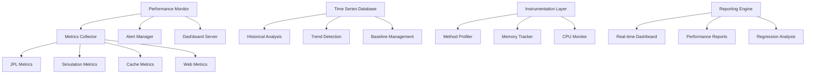

# Design Document

## Overview

The Performance Monitoring System will provide comprehensive performance tracking, analysis, and optimization capabilities for the Solar System Suite. The system will use modern C++20 features, real-time monitoring, historical analysis, and automated alerting to ensure optimal performance across all components.

## Architecture

### System Architecture



### Component Architecture

The performance monitoring system will be implemented as a separate library (`solar_performance`) with the following structure:

```
lib/solar_performance/
├── include/solar_performance/
│   ├── core/
│   │   ├── performance_monitor.hpp
│   │   ├── metrics_collector.hpp
│   │   ├── instrumentation.hpp
│   │   └── profiler.hpp
│   ├── storage/
│   │   ├── time_series_db.hpp
│   │   ├── metrics_storage.hpp
│   │   └── baseline_manager.hpp
│   ├── analysis/
│   │   ├── trend_analyzer.hpp
│   │   ├── regression_detector.hpp
│   │   └── performance_analyzer.hpp
│   ├── alerts/
│   │   ├── alert_manager.hpp
│   │   ├── threshold_monitor.hpp
│   │   └── notification_system.hpp
│   └── dashboard/
│       ├── dashboard_server.hpp
│       ├── metrics_api.hpp
│       └── web_interface.hpp
└── src/
    ├── core/
    ├── storage/
    ├── analysis/
    ├── alerts/
    └── dashboard/
```

## Components and Interfaces

### Performance Monitor Core

```cpp
class PerformanceMonitor {
public:
    struct Configuration {
        std::chrono::milliseconds collection_interval = std::chrono::seconds(1);
        std::chrono::hours retention_period = std::chrono::hours(24 * 30);  // 30 days
        bool enable_real_time_alerts = true;
        bool enable_historical_analysis = true;
        std::string storage_path = "./performance_data";
        size_t max_memory_usage_mb = 1024;
    };

    explicit PerformanceMonitor(Configuration config);

    // Lifecycle management
    void start();
    void stop();
    [[nodiscard]] bool is_running() const;

    // Instrumentation registration
    void register_component(const std::string& component_name);
    void register_operation(const std::string& component, const std::string& operation);

    // Metrics collection
    void record_execution_time(const std::string& operation, std::chrono::nanoseconds duratio
   void record_memory_usage(const std::string& component, size_t bytes);
    void record_custom_metric(const std::string& name, double value, const std::string& unit = "");

    // Real-time access
    [[nodiscard]] PerformanceSnapshot get_current_snapshot() const;
    [[nodiscard]] std::vector<MetricSample> get_recent_metrics(const std::string& metric_name,
                                                              std::chrono::minutes duration) const;

private:
    Configuration config_;
    std::unique_ptr<MetricsCollector> collector_;
    std::unique_ptr<TimeSeriesDatabase> database_;
    std::unique_ptr<AlertManager> alert_manager_;
    std::atomic<bool> running_{false};
};
```

### Instrumentation Framework

```cpp
class Instrumentation {
public:
    // RAII-based timing
    class Timer {
    public:
        explicit Timer(const std::string& operation_name);
        ~Timer();

        void add_metadata(const std::string& key, const std::string& value);
        void set_success(bool success);

    private:
        std::string operation_name_;
        std::chrono::high_resolution_clock::time_point start_time_;
        std::map<std::string, std::string> metadata_;
        bool success_ = true;
    };

    // Memory tracking
    class MemoryTracker {
    public:
        explicit MemoryTracker(const std::string& component_name);
        ~MemoryTracker();

        void record_allocation(size_t bytes);
        void record_deallocation(size_t bytes);
        [[nodiscard]] size_t current_usage() const;

    private:
        std::string component_name_;
        std::atomic<size_t> current_usage_{0};
        size_t peak_usage_ = 0;
    };

    // Convenience macros for instrumentation
    static Timer time_operation(const std::string& name);
    static MemoryTracker track_memory(const std::string& component);

    // Custom metrics
    static void record_counter(const std::string& name, int64_t value = 1);
    static void record_gauge(const std::string& name, double value);
    static void record_histogram(const std::string& name, double value);
};

// Convenience macros
#define PERF_TIME_OPERATION(name) auto _timer = Instrumentation::time_operation(name)
#define PERF_TIME_FUNCTION() auto _timer = Instrumentation::time_operation(__FUNCTION__)
#define PERF_TRACK_MEMORY(component) auto _tracker = Instrumentation::track_memory(component)
```

### Metrics Collection and Storage

```cpp
struct MetricSample {
    std::string name;
    double value;
    std::string unit;
    std::chrono::system_clock::time_point timestamp;
    std::map<std::string, std::string> tags;

    [[nodiscard]] std::string to_json() const;
    [[nodiscard]] static MetricSample from_json(const std::string& json);
};

class TimeSeriesDatabase {
public:
    struct QueryOptions {
        std::chrono::system_clock::time_point start_time;
        std::chrono::system_clock::time_point end_time;
        std::chrono::seconds aggregation_interval = std::chrono::seconds(60);
        std::string aggregation_function = "avg";  // avg, min, max, sum, count
        std::map<std::string, std::string> tag_filters;
    };

    explicit TimeSeriesDatabase(const std::string& storage_path);

    // Data ingestion
    void insert_sample(const MetricSample& sample);
    void insert_batch(const std::vector<MetricSample>& samples);

    // Data retrieval
    [[nodiscard]] std::vector<MetricSample> query(const std::string& metric_name,
                                                  const QueryOptions& options) const;
    [[nodiscard]] std::vector<std::string> get_metric_names() const;
    [[nodiscard]] std::map<std::string, std::string> get_metric_tags(const std::string& metric_name) const;

    // Data management
    void compact_data();
    void cleanup_old_data(std::chrono::hours retention_period);
    [[nodiscard]] size_t get_storage_size() const;

private:
    std::string storage_path_;
    std::unique_ptr<class DatabaseImpl> impl_;
};
```

### Performance Analysis

```cpp
class PerformanceAnalyzer {
public:
    struct AnalysisResult {
        std::string metric_name;
        double current_value;
        double baseline_value;
        double percentage_change;
        TrendDirection trend;
        std::vector<Anomaly> anomalies;
        std::optional<Recommendation> recommendation;
    };

    enum class TrendDirection {
        Improving,
        Stable,
        Degrading,
        Unknown
    };

    struct Anomaly {
        std::chrono::system_clock::time_point timestamp;
        double value;
        double expected_value;
        double deviation_score;
        std::string description;
    };

    explicit PerformanceAnalyzer(std::shared_ptr<TimeSeriesDatabase> database);

    // Trend analysis
    [[nodiscard]] AnalysisResult analyze_metric_trend(const std::string& metric_name,
                                                      std::chrono::hours analysis_period) const;
    [[nodiscard]] std::vector<AnalysisResult> analyze_all_metrics() const;

    // Anomaly detection
    [[nodiscard]] std::vector<Anomaly> detect_anomalies(const std::string& metric_name,
                                                        std::chrono::hours analysis_period) const;

    // Performance regression detection
    [[nodiscard]] bool has_performance_regression(const std::string& metric_name,
                                                  double threshold_percentage = 10.0) const;

    // Baseline management
    void update_baseline(const std::string& metric_name);
    void set_baseline(const std::string& metric_name, double value);
    [[nodiscard]] std::optional<double> get_baseline(const std::string& metric_name) const;

private:
    std::shared_ptr<TimeSeriesDatabase> database_;
    std::map<std::string, double> baselines_;
};
```

### Alert Management

```cpp
class AlertManager {
public:
    enum class AlertSeverity {
        Info,
        Warning,
        Critical,
        Emergency
    };

    struct AlertRule {
        std::string name;
        std::string metric_name;
        std::string condition;  // "greater_than", "less_than", "percentage_change"
        double threshold;
        AlertSeverity severity;
        std::chrono::minutes evaluation_window = std::chrono::minutes(5);
        std::chrono::minutes cooldown_period = std::chrono::minutes(15);
        std::vector<std::string> notification_channels;
    };

    struct Alert {
        std::string rule_name;
        std::string metric_name;
        double current_value;
        double threshold;
        AlertSeverity severity;
        std::chrono::system_clock::time_point triggered_at;
        std::string description;
        std::map<std::string, std::string> metadata;
    };

    explicit AlertManager(std::shared_ptr<TimeSeriesDatabase> database);

    // Rule management
    void add_alert_rule(const AlertRule& rule);
    void remove_alert_rule(const std::string& rule_name);
    void update_alert_rule(const AlertRule& rule);
    [[nodiscard]] std::vector<AlertRule> get_alert_rules() const;

    // Alert evaluation
    void evaluate_alerts();
    [[nodiscard]] std::vector<Alert> get_active_alerts() const;
    [[nodiscard]] std::vector<Alert> get_alert_history(std::chrono::hours period) const;

    // Notification channels
    void add_notification_channel(const std::string& name,
                                 std::unique_ptr<NotificationChannel> channel);
    void send_test_notification(const std::string& channel_name);

private:
    std::shared_ptr<TimeSeriesDatabase> database_;
    std::vector<AlertRule> rules_;
    std::vector<Alert> active_alerts_;
    std::map<std::string, std::unique_ptr<NotificationChannel>> notification_channels_;
};

class NotificationChannel {
public:
    virtual ~NotificationChannel() = default;
    virtual void send_notification(const AlertManager::Alert& alert) = 0;
    virtual bool test_connection() = 0;
};

class EmailNotificationChannel : public NotificationChannel {
public:
    struct Configuration {
        std::string smtp_server;
        int smtp_port = 587;
        std::string username;
        std::string password;
        std::vector<std::string> recipients;
    };

    explicit EmailNotificationChannel(Configuration config);
    void send_notification(const AlertManager::Alert& alert) override;
    bool test_connection() override;
};
```

### Dashboard and Visualization

```cpp
class DashboardServer {
public:
    struct Configuration {
        std::string bind_address = "0.0.0.0";
        int port = 8090;
        std::string web_root = "./dashboard/web";
        bool enable_api = true;
        bool enable_websockets = true;
    };

    explicit DashboardServer(Configuration config,
                           std::shared_ptr<PerformanceMonitor> monitor);

    // Server lifecycle
    void start();
    void stop();
    [[nodiscard]] bool is_running() const;

    // API endpoints
    void register_api_endpoint(const std::string& path,
                              std::function<std::string(const std::string&)> handler);

private:
    Configuration config_;
    std::shared_ptr<PerformanceMonitor> monitor_;
    std::unique_ptr<class WebServer> web_server_;
};

class MetricsAPI {
public:
    explicit MetricsAPI(std::shared_ptr<PerformanceMonitor> monitor);

    // REST API handlers
    std::string handle_metrics_list(const std::string& request);
    std::string handle_metrics_query(const std::string& request);
    std::string handle_performance_summary(const std::string& request);
    std::string handle_alerts_list(const std::string& request);
    std::string handle_system_status(const std::string& request);

private:
    std::shared_ptr<PerformanceMonitor> monitor_;
};
```

## Data Models

### Performance Metrics

```cpp
struct PerformanceSnapshot {
    std::chrono::system_clock::time_point timestamp;

    // System metrics
    double cpu_usage_percentage;
    size_t memory_usage_bytes;
    size_t memory_peak_bytes;

    // Component metrics
    std::map<std::string, ComponentMetrics> component_metrics;

    // Operation metrics
    std::map<std::string, OperationMetrics> operation_metrics;

    [[nodiscard]] std::string to_json() const;
};

struct ComponentMetrics {
    std::string component_name;
    size_t memory_usage_bytes;
    double cpu_usage_percentage;
    size_t active_operations;
    std::chrono::nanoseconds total_execution_time;
    size_t operation_count;
    double operations_per_second;
};

struct OperationMetrics {
    std::string operation_name;
    std::chrono::nanoseconds min_execution_time;
    std::chrono::nanoseconds max_execution_time;
    std::chrono::nanoseconds avg_execution_time;
    std::chrono::nanoseconds total_execution_time;
    size_t execution_count;
    size_t success_count;
    size_t failure_count;
    double success_rate;
};
```

## Error Handling

The performance monitoring system will use structured error handling:

```cpp
enum class PerformanceError {
    DatabaseConnectionFailed,
    MetricCollectionFailed,
    AlertEvaluationFailed,
    NotificationFailed,
    DashboardStartupFailed,
    StorageSpaceExhausted,
    InvalidConfiguration
};

template<typename T>
using PerformanceResult = Expected<T, PerformanceError>;
```

## Testing Strategy

### Unit Tests
- Test individual performance monitoring components
- Mock time and system resources for consistent testing
- Validate metric collection accuracy
- Test alert rule evaluation logic

### Integration Tests
- Test complete monitoring pipeline
- Validate database storage and retrieval
- Test alert notification delivery
- Verify dashboard API functionality

### Performance Tests
- Benchmark monitoring overhead
- Test scalability with high metric volumes
- Validate memory usage under load
- Test long-running monitoring stability

## Implementation Phases

### Phase 1: Core Infrastructure
- Implement PerformanceMonitor and MetricsCollector
- Create basic instrumentation framework
- Set up time series database storage
- Implement basic metric recording and retrieval

### Phase 2: Analysis and Alerting
- Add performance analysis capabilities
- Implement alert rule engine
- Create notification system
- Add baseline management

### Phase 3: Dashboard and Visualization
- Build web-based dashboard
- Implement REST API for metrics access
- Add real-time metric streaming
- Create performance visualization components

### Phase 4: Advanced Features
- Add machine learning-based anomaly detection
- Implement predictive performance analysis
- Create automated performance optimization suggestions
- Add integration with external monitoring systems
