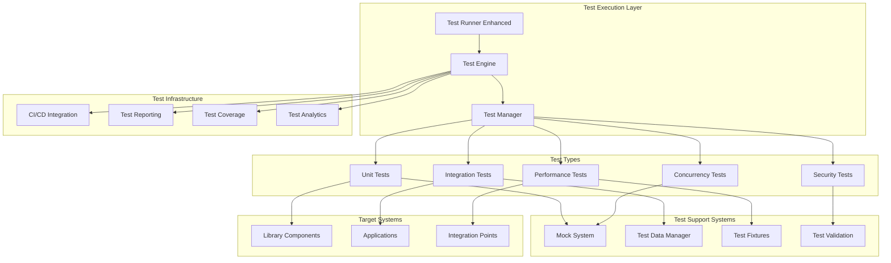
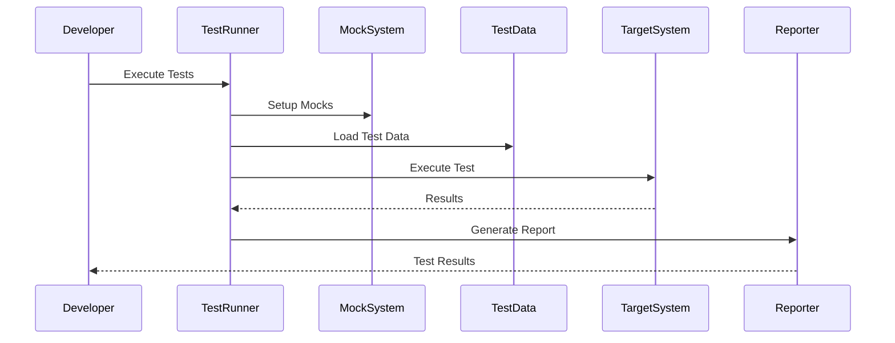
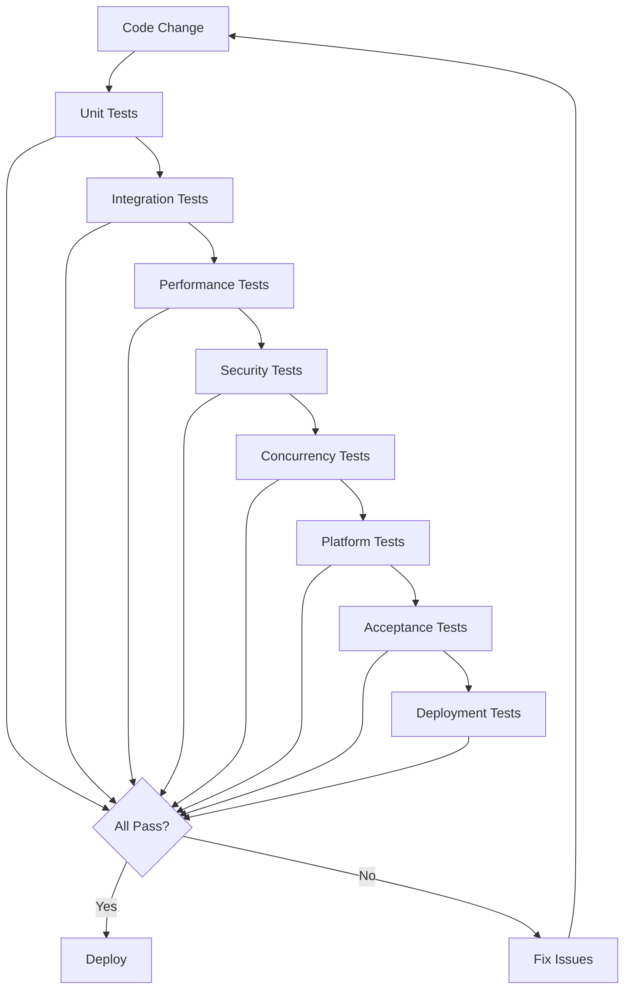

# Design Document - Test Suite Completion

## Overview

This design document outlines the comprehensive completion of all test suites in the Solar System Suite. The design transforms placeholder tests into a robust, comprehensive testing framework that ensures code quality, reliability, and maintainability through thorough validation of all system components.

## Architecture

### Comprehensive Testing Architecture



### Test Data Flow Architecture



## Components and Interfaces

### 1. Enhanced Unit Test Framework

#### Core Enhancements
- **Complete Coverage**: 100% code coverage for all components
- **Edge Case Testing**: Comprehensive boundary and error condition testing
- **Fast Execution**: Optimized for quick feedback cycles
- **Clear Diagnostics**: Detailed failure analysis and debugging information

#### Interface Design
```cpp
class EnhancedUnitTestFramework {
public:
    // Test execution with coverage
    [[nodiscard]] TestResult execute_unit_tests(
        const TestSuite& suite,
        const CoverageOptions& coverage_opts = {}
    );

    // Test discovery and filtering
    [[nodiscard]] std::vector<TestCase> discover_tests(
        const std::filesystem::path& test_directory,
        const TestFilter& filter = {}
    );

    // Coverage analysis
    [[nodiscard]] CoverageReport analyze_coverage(
        const TestExecutionResult& results
    );

    // Performance profiling
    [[nodiscard]] PerformanceProfile profile_test_execution(
        const TestCase& test_case
    );
};
```

### 2. Comprehensive Integration Test System

#### Core Enhancements
- **End-to-End Validation**: Complete workflow and data flow testing
- **Component Interaction**: Thorough interface and communication testing
- **Environment Simulation**: Realistic test environments and scenarios
- **Failure Analysis**: Detailed diagnostic information for failures

#### Interface Design
```cpp
class EnhancedIntegrationTestSystem {
public:
    // Workflow testing
    [[nodiscard]] IntegrationTestResult test_workflow(
        const WorkflowDefinition& workflow,
        const TestEnvironment& environment
    );

    // Component interaction testing
    [[nodiscard]] InteractionTestResult test_component_interactions(
        const std::vector<Component>& components,
        const InteractionScenarios& scenarios
    );

    // Environment management
    [[nodiscard]] std::unique_ptr<TestEnvironment> create_test_environment(
        const EnvironmentConfig& config
    );

    // Data flow validation
    [[nodiscard]] DataFlowTestResult validate_data_flow(
        const DataFlowDefiniti
       const ValidationCriteria& criteria
    );
};
```

### 3. Advanced Performance Testing Framework

#### Core Enhancements
- **Statistical Analysis**: Robust statistical methods for performance comparison
- **Baseline Management**: Comprehensive baseline tracking and comparison
- **Regression Detection**: Automated detection of performance regressions
- **Optimization Guidance**: Detailed performance analysis and recommendations

#### Interface Design
```cpp
class AdvancedPerformanceTestFramework {
public:
    // Performance measurement
    [[nodiscard]] PerformanceResult measure_performance(
        const PerformanceTest& test,
        const MeasurementConfig& config
    );

    // Baseline management
    [[nodiscard]] BaselineResult update_baseline(
        const std::string& test_name,
        const PerformanceResult& result
    );

    // Regression analysis
    [[nodiscard]] RegressionAnalysis analyze_regression(
        const PerformanceResult& current,
        const PerformanceBaseline& baseline
    );

    // Optimization recommendations
    [[nodiscard]] OptimizationReport generate_optimization_recommendations(
        const PerformanceProfile& profile
    );
};
```

### 4. Comprehensive Mock and Stub System

#### Core Enhancements
- **Realistic Behavior**: Mocks that accurately simulate real component behavior
- **Programmable Responses**: Flexible mock configuration and response programming
- **State Management**: Stateful mocks that maintain realistic state transitions
- **Interaction Verification**: Detailed verification of mock interactions

#### Interface Design
```cpp
template<typename Interface>
class EnhancedMockSystem {
public:
    // Mock creation and configuration
    [[nodiscard]] std::unique_ptr<MockObject<Interface>> create_mock(
        const MockConfiguration& config = {}
    );

    // Behavior programming
    void program_behavior(
        MockObject<Interface>& mock,
        const BehaviorDefinition& behavior
    );

    // State management
    void set_mock_state(
        MockObject<Interface>& mock,
        const MockState& state
    );

    // Interaction verification
    [[nodiscard]] VerificationResult verify_interactions(
        const MockObject<Interface>& mock,
        const ExpectedInteractions& expected
    );
};

class MockBehaviorBuilder {
public:
    // Method call expectations
    MockBehaviorBuilder& expect_call(
        const std::string& method_name,
        const std::vector<std::any>& parameters = {}
    );

    // Return value configuration
    MockBehaviorBuilder& return_value(const std::any& value);
    MockBehaviorBuilder& throw_exception(const std::exception& exception);

    // State transitions
    MockBehaviorBuilder& transition_to_state(const MockState& state);

    // Build behavior
    [[nodiscard]] BehaviorDefinition build();
};
```

### 5. Advanced Test Data Management

#### Core Enhancements
- **Realistic Data Generation**: Data that matches production characteristics
- **Data Validation**: Comprehensive validation and consistency checking
- **Environment Isolation**: Isolated test environments with proper cleanup
- **Data Versioning**: Version control for test data and schemas

#### Interface Design
```cpp
class AdvancedTestDataManager {
public:
    // Data generation
    [[nodiscard]] TestDataSet generate_realistic_data(
        const DataSchema& schema,
        const GenerationOptions& options
    );

    // Data validation
    [[nodiscard]] ValidationResult validate_test_data(
        const TestDataSet& data,
        const ValidationRules& rules
    );

    // Environment management
    [[nodiscard]] std::unique_ptr<IsolatedTestEnvironment> create_isolated_environment(
        const EnvironmentSpec& spec
    );

    // Data versioning
    [[nodiscard]] DataVersion save_data_version(
        const TestDataSet& data,
        const std::string& version_name
    );

    [[nodiscard]] TestDataSet load_data_version(
        const std::string& version_name
    );
};
```

## Data Models

### Test Configuration and Metadata

```cpp
struct TestConfiguration {
    std::string test_name;
    TestType type;
    std::vector<std::string> tags;
    std::chrono::milliseconds timeout;
    int retry_count;
    TestPriority priority;

    // Resource requirements
    ResourceRequirements resources;

    // Dependencies
    std::vector<std::string> dependencies;

    // Environment requirements
    EnvironmentRequirements environment;

    // Validation
    [[nodiscard]] bool is_valid() const;
};

struct TestResult {
    std::string test_name;
    TestStatus status;
    std::chrono::nanoseconds execution_time;
    std::string error_message;
    std::string diagnostic_info;

    // Performance metrics
    PerformanceMetrics performance;

    // Coverage information
    CoverageInfo coverage;

    // Resource usage
    ResourceUsage resource_usage;

    // Artifacts
    std::vector<TestArtifact> artifacts;
};
```

### Performance Testing Models

```cpp
struct PerformanceMetrics {
    std::chrono::nanoseconds execution_time;
    std::chrono::nanoseconds cpu_time;
    size_t memory_peak_usage;
    size_t memory_average_usage;
    double cpu_utilization;
    size_t io_operations;
    size_t network_operations;

    // Statistical measures
    double mean;
    double median;
    double standard_deviation;
    double percentile_95;
    double percentile_99;
};

struct PerformanceBaseline {
    std::string test_name;
    std::chrono::system_clock::time_point created_at;
    PerformanceMetrics baseline_metrics;
    StatisticalModel model;

    // Thresholds
    double regression_threshold;
    double improvement_threshold;

    // Validation
    [[nodiscard]] bool is_regression(const PerformanceMetrics& current) const;
    [[nodiscard]] double calculate_change_percentage(const PerformanceMetrics& current) const;
};
```

### Mock System Models

```cpp
struct MockConfiguration {
    std::string mock_name;
    MockType type;
    bool strict_mode;
    bool record_interactions;

    // Default behaviors
    std::map<std::string, DefaultBehavior> default_behaviors;

    // State configuration
    std::optional<MockState> initial_state;

    // Logging configuration
    LoggingConfig logging;
};

struct MockInteraction {
    std::chrono::system_clock::time_point timestamp;
    std::string method_name;
    std::vector<std::any> parameters;
    std::any return_value;
    std::optional<std::exception> exception;

    // Context information
    std::string caller_context;
    std::thread::id thread_id;
};

class MockVerifier {
public:
    // Interaction verification
    [[nodiscard]] bool verify_call_count(
        const std::string& method_name,
        int expected_count
    ) const;

    [[nodiscard]] bool verify_call_order(
        const std::vector<std::string>& expected_order
    ) const;

    [[nodiscard]] bool verify_parameters(
        const std::string& method_name,
        const std::vector<std::any>& expected_parameters
    ) const;

    // State verification
    [[nodiscard]] bool verify_final_state(
        const MockState& expected_state
    ) const;
};
```

## Error Handling

### Comprehensive Test Error Management

```cpp
enum class TestErrorType {
    // Setup errors
    TestSetupFailed,
    MockConfigurationError,
    TestDataError,
    EnvironmentError,

    // Execution errors
    TestExecutionFailed,
    TimeoutError,
    ResourceError,
    ConcurrencyError,

    // Validation errors
    AssertionFailed,
    ValidationError,
    ComparisonError,

    // Infrastructure errors
    TestFrameworkError,
    ReportingError,
    CoverageError
};

struct TestError {
    TestErrorType type;
    std::string message;
    std::string context;
    std::string test_name;
    std::chrono::system_clock::time_point timestamp;

    // Diagnostic information
    std::string stack_trace;
    std::map<std::string, std::string> diagnostic_data;

    // Recovery suggestions
    std::vector<std::string> recovery_suggestions;
};

class TestErrorHandler {
public:
    // Error reporting
    void report_error(const TestError& error);

    // Error analysis
    [[nodiscard]] ErrorPattern analyze_error_patterns(
        const std::vector<TestError>& errors
    ) const;

    // Recovery assistance
    [[nodiscard]] std::vector<RecoveryAction> suggest_recovery_actions(
        const TestError& error
    ) const;
};
```

## Testing Strategy

### Multi-Level Testing Approach



### Test Execution Strategy

1. **Fast Feedback Loop**
   - Unit tests run on every code change
   - Quick validation of basic functionality
   - Immediate feedback to developers

2. **Comprehensive Validation**
   - Integration tests run on pull requests
   - Performance tests run on release candidates
   - Security tests run on security-sensitive changes

3. **Quality Gates**
   - Code coverage requirements
   - Performance regression thresholds
   - Security vulnerability checks

4. **Continuous Monitoring**
   - Test result trending and analysis
   - Performance baseline tracking
   - Error pattern detection and alerting

## Implementation Strategy

### Development Phases

#### Phase 1: Unit Test Completion (Weeks 1-3)
- Replace all placeholder unit tests
- Achieve 100% code coverage
- Implement comprehensive edge case testing
- Add performance profiling for unit tests

#### Phase 2: Integration Test Enhancement (Weeks 4-6)
- Implement end-to-end workflow testing
- Add component interaction validation
- Create realistic test environments
- Implement failure analysis and diagnostics

#### Phase 3: Performance Test Implementation (Weeks 7-8)
- Create comprehensive performance test suite
- Implement baseline management system
- Add regression detection and analysis
- Create optimization recommendation system

#### Phase 4: Mock and Test Data Systems (Weeks 9-10)
- Implement advanced mock system
- Create comprehensive test data management
- Add data generation and validation
- Implement environment isolation

#### Phase 5: Specialized Testing (Weeks 11-12)
- Implement security testing framework
- Add concurrency and thread safety tests
- Create platform and environment tests
- Implement error scenario testing

#### Phase 6: Infrastructure and Automation (Weeks 13-14)
- Integrate with CI/CD systems
- Implement test reporting and analytics
- Add test automation and scheduling
- Create test maintenance and monitoring tools

### Quality Assurance

#### Test Quality Standards
- 100% code coverage for all components
- Comprehensive edge case and error scenario testing
- Performance tests with statistical validation
- Security tests covering all attack vectors
- Concurrency tests for all shared resources

#### Test Reliability Standards
- Tests must be deterministic and repeatable
- No flaky or intermittent test failures
- Proper test isolation and cleanup
- Clear, actionable error messages
- Fast execution for quick feedback

#### Test Maintenance Standards
- Regular review and update of test cases
- Baseline updates for performance tests
- Test data refresh and validation
- Mock behavior updates to match real components
- Documentation updates for test procedures
