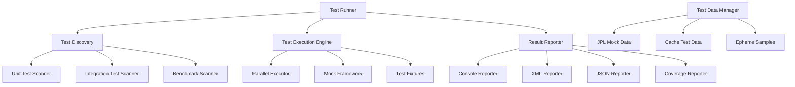

# Design Document

## Overview

The Testing Framework Enhancement will provide a comprehensive, modern testing infrastructure for the Solar System Suite. The framework will support unit testing, integration testing, performance benchmarking, and CI/CD integration using modern C++20 features and industry best practices.

## Architecture

### Core Components



### Framework Architecture

The testing framework will be built as a separate library (`solar_test`) with the following structure:

```
lib/solar_test/
├── include/solar_test/
│   ├── framework/
│   │   ├── test_runner.hpp
│   │   ├── test_case.hpp
│   │   ├── assertions.hpp
│   │   └── fixtures.hpp
│   ├── mocks/
│   │   ├── jpl_mock.hpp
│   │   ├── cache_mock.hpp
│   │   └── network_mock.hpp
│   ├── benchmarks/
│   │   ├── benchmark.hpp
│   │   └── performance_monitor.hpp
│   └── reporters/
│       ├── console_reporter.hpp
│       ├── xml_reporter.hpp
│       └── json_reporter.hpp
└── src/
    ├── framework/
    ├── mocks/
    ├── benchmarks/
    └── reporters/
```

## Components and Interfaces

### Test Runner Interface

```cpp
class TestRunner {
public:
    struct Configuration {
        std::vector<std::string> test_patterns;
        std::vector<std::string> tags;
        bool parallel_execution = true;
        size_t max_threads = std::thread::hardware_concurrency();
        std::chrono::milliseconds timeout = std::chrono::minutes(5);
        bool generate_coverage = false;
        std::string output_format = "console";
        std::string output_file;
    };

    explicit TestRunner(Configuration config);

    // Test discovery and execution
    [[nodiscard]] TestResult run_all_tests();
    [[nodiscard]] TestResult run_tests_with_tag(const std::string& tag);
    [[nodiscard]] TestResult run_specific_test(const std::string& test_name);

    // Reporting
    void add_reporter(std::unique_ptr<TestReporter> reporter);
    void generate_coverage_report(const std::string& output_path);

private:
    Configuration config_;
    std::vector<std::unique_ptr<TestCase>> discovered_tests_;
    std::vector<std::unique_ptr<TestReporter>> reporters_;
};
```

### Test Case Base Class

```cpp
class TestCase {
public:
    struct TestInfo {
        std::string name;
        std::string description;
        std::vector<std::string> tags;
        std::chrono::milliseconds timeout = std::chrono::seconds(30);
        bool is_benchmark = false;
    };

    explicit TestCase(TestInfo info);
    virtual ~TestCase() = default;

    // Test lifecycle
    virtual void setup() {}
    virtual void run() = 0;
    virtual void teardown() {}

    // Test information
    [[nodiscard]] const TestInfo& info() const { return info_; }
    [[nodiscard]] TestResult result() const { return result_; }

protected:
    // Assertion helpers
    void assert_true(bool condition, const std::string& message = "");
    void assert_false(bool condition, const std::string& message = "");
    void assert_equals(const auto& expected, const auto& actual, const std::string& message = "");
    void assert_throws(const std::function<void()>& func, const std::string& message = "");
    void assert_no_throw(const std::function<void()>& func, const std::string& message = "");

    // Performance assertions
    void assert_execution_time_less_than(const std::function<void()>& func,
                                       std::chrono::milliseconds max_time);
    void assert_memory_usage_less_than(const std::function<void()>& func, size_t max_bytes);

private:
    TestInfo info_;
    TestResult result_;
};
```

### Mock Framework

```cpp
class JPLMock {
public:
    struct MockConfiguration {
        bool simulate_network_delays = false;
        std::chrono::milliseconds response_delay = std::chrono::milliseconds(100);
        double failure_rate = 0.0;  // 0.0 = never fail, 1.0 = always fail
        std::string mock_data_path = "tests/data/jpl_responses/";
    };

    explicit JPLMock(MockConfiguration config = {});

    // Mock JPL API responses
    void set_response_for_body(const std::string& body_name, const std::string& response);
    void set_error_response(int http_code, const std::string& error_message);
    void simulate_network_failure();
    void simulate_timeout();

    // Verification
    [[nodiscard]] size_t call_count() const;
    [[nodiscard]] std::vector<std::string> requested_bodies() const;
    void reset_call_history();

private:
    MockConfiguration config_;
    std::map<std::string, std::string> mock_responses_;
    std::vector<std::string> call_history_;
    size_t call_count_ = 0;
};

class CacheMock {
public:
    // Mock cache operations without actual file I/O
    void set_cache_exists(bool exists);
    void set_cache_valid(bool valid);
    void set_cache_data(const std::string& data);
    void simulate_cache_corruption();
    void simulate_disk_full();

    // Verification
    [[nodiscard]] bool was_cache_read() const;
    [[nodiscard]] bool was_cache_written() const;
    [[nodiscard]] std::string last_written_data() const;
};
```

### Benchmark Framework

```cpp
class Benchmark {
public:
    struct BenchmarkResult {
        std::string name;
        std::chrono::nanoseconds min_time;
        std::chrono::nanoseconds max_time;
        std::chrono::nanoseconds mean_time;
        std::chrono::nanoseconds median_time;
        size_t iterations;
        double operations_per_second;
        size_t memory_usage_bytes;
    };

    explicit Benchmark(const std::string& name);

    // Benchmark execution
    template<typename Func>
    BenchmarkResult measure(Func&& func, size_t iterations = 1000);

    template<typename Func>
    BenchmarkResult measure_with_setup(Func&& setup, Func&& func, size_t iterations = 1000);

    // Performance thresholds
    void set_time_threshold(std::chrono::nanoseconds max_time);
    void set_memory_threshold(size_t max_bytes);
    void set_operations_per_second_threshold(double min_ops_per_sec);

private:
    std::string name_;
    std::optional<std::chrono::nanoseconds> time_threshold_;
    std::optional<size_t> memory_threshold_;
    std::optional<double> ops_per_sec_threshold_;
};
```

### Test Data Management

```cpp
class TestDataManager {
public:
    struct TestDataSet {
        std::string name;
        std::string description;
        std::map<std::string, std::string> files;
        std::map<std::string, std::string> metadata;
    };

    // Test data loading
    [[nodiscard]] static TestDataSet load_jpl_responses(const std::string& scenario);
    [[nodiscard]] static TestDataSet load_ephemeris_data(const std::string& time_period);
    [[nodiscard]] static TestDataSet load_cache_samples(const std::string& cache_type);

    // Temporary test environments
    [[nodiscard]] static std::unique_ptr<TemporaryDirectory> create_test_environment();
    [[nodiscard]] static std::unique_ptr<TemporaryCache> create_test_cache();

    // Data validation
    [[nodiscard]] static bool validate_jpl_response(const std::string& response);
    [[nodiscard]] static bool validate_ephemeris_data(const std::string& data);
    [[nodiscard]] static bool validate_cache_integrity(const std::string& cache_path);
};
```

## Data Models

### Test Result Structure

```cpp
struct TestResult {
    enum class Status {
        Passed,
        Failed,
        Skipped,
        Timeout,
        Error
    };

    Status status = Status::Failed;
    std::string test_name;
    std::string error_message;
    std::chrono::milliseconds execution_time{0};
    size_t memory_usage_bytes = 0;
    std::vector<std::string> assertion_failures;
    std::map<std::string, std::string> metadata;

    [[nodiscard]] bool passed() const { return status == Status::Passed; }
    [[nodiscard]] bool failed() const { return status == Status::Failed; }
};

struct TestSuiteResult {
    std::string suite_name;
    std::vector<TestResult> test_results;
    std::chrono::milliseconds total_execution_time{0};
    size_t passed_count = 0;
    size_t failed_count = 0;
    size_t skipped_count = 0;
    double code_coverage_percentage = 0.0;

    [[nodiscard]] bool all_passed() const { return failed_count == 0; }
    [[nodiscard]] double success_rate() const;
};
```

## Error Handling

The testing framework will use structured error handling with specific error types:

```cpp
enum class TestError {
    TestDiscoveryFailed,
    TestExecutionTimeout,
    AssertionFailed,
    MockSetupFailed,
    TestDataNotFound,
    ReporterError,
    BenchmarkThresholdExceeded
};

template<typename T>
using TestResult = Expected<T, TestError>;
```

## Testing Strategy

### Unit Tests
- Test individual classes and functions in isolation
- Use mocks for external dependencies (JPL API, file system, network)
- Focus on edge cases and error conditions
- Validate all public interfaces

### Integration Tests
- Test complete data flow pipelines
- Validate JPL → BodyFactory → Simulation → Web integration
- Test cache systems with real file operations
- Validate network error handling and retries

### Performance Tests
- Benchmark critical operations (cache loading, simulation steps, JPL parsing)
- Validate performance claims (1000x cache improvement, microsecond simulation)
- Monitor memory usage and detect leaks
- Test scalability with large datasets

### End-to-End Tests
- Test complete user workflows
- Validate web interface functionality
- Test command-line applications
- Verify installation and deployment processes

## Implementation Phases

### Phase 1: Core Framework
- Implement TestRunner and TestCase base classes
- Create basic assertion framework
- Implement console reporter
- Set up test discovery mechanism

### Phase 2: Mock Framework
- Implement JPL API mocking
- Create cache operation mocks
- Add network simulation capabilities
- Implement test data management

### Phase 3: Advanced Features
- Add benchmark framework
- Implement parallel test execution
- Create XML/JSON reporters for CI integration
- Add code coverage analysis

### Phase 4: Integration
- Integrate with existing build system
- Create comprehensive test suites for all components
- Set up CI/CD integration
- Add performance regression detection
