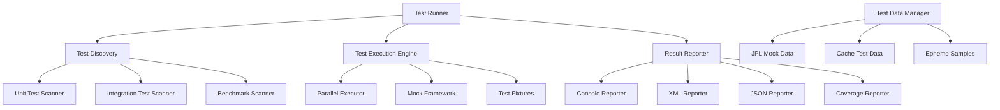

# Design Document

## Overview

The Testing Framework Enhancement will implement a comprehensive, modern testing framework for the Solar System Suite that addresses the complete testing lifecycle from unit testing to CI/CD integration. The project currently has basic testing infrastructure but lacks the robust framework needed to validate complex interactions between JPL data, simulation engines, and web interfaces. This enhancement will create a professional-grade testing system with automated test discovery, performance benchmarking, mock frameworks, and seamless CI/CD integration that ensures code quality and prevents regressions.

## Architecture

### Existing CI/CD Infrastructure

The project already has a comprehensive GitHub Actions setup that needs to be completed and fixed:

#### Current CI/CD Components
- **ci.yml**: Main CI/CD workflow with multi-platform builds, testing, and deployment
- **docs.yml**: Documentation generation and GitHub Pages deployment
- **compare_performance.py**: Performance regression detection script
- **CMake test configuration**: Test discovery and execution framework
- **Test directory structure**: Organized unit, integration, and benchmark test categories

#### Issues to Address
1. **Missing test implementations**: CI references test labels ("unit", "integration", "benchmark") but actual tests don't exist
2. **Incomplete solar_test library**: Framework structure exists but implementation is missing
3. **Performance baseline missing**: CI expects benchmark CSV files that aren't generated
4. **Test data gaps**: Mock data and test fixtures referenced but not implemented
5. **Code quality false positives**: Some linters need configuration adjustments

#### Integration Strategy
The testing framework will integrate with existing CI/CD by:
- Implementing missing test executables that ctest can discover
- Generating performance CSV output compatible with compare_performance.py
- Creating test artifacts in expected locations for GitHub Actions
- Ensuring all referenced commands and scripts work correctly

### Core Components



### Test Organization and Categorization

The framework supports comprehensive test categorization to meet requirement 5 (test organization):

```cpp
enum class TestCategory {
    Unit,           // Individual component testing
    Integration,    // End-to-end pipeline testing
    Performance,    // Benchmarking and regression detection
    Slow,          // Long-running tests
    Network,       // Tests requiring external connectivity
    Cache,         // File system and caching tests
    Mock          // Tests using mock implementations
};

class TestRegistry {
public:
    void register_test(std::unique_ptr<TestCase> test, std::vector<TestCategory> categories);
    std::vector<TestCase*> find_tests_by_category(TestCategory category);
    std::vector<TestCase*> find_tests_by_tag(const std::string& tag);
    std::vector<TestCase*> find_tests_by_pattern(const std::string& pattern);
};
```

### Framework Architecture

The testing framework will be built as a separate library (`solar_test`) with the following structure:

```
lib/solar_test/
├── include/solar_test/
│   ├── framework/
│   │   ├── test_runner.hpp
│   │   ├── test_case.hpp
│   │   ├── assertions.hpp
│   │   └── fixtures.hpp
│   ├── mocks/
│   │   ├── jpl_mock.hpp
│   │   ├── cache_mock.hpp
│   │   └── network_mock.hpp
│   ├── benchmarks/
│   │   ├── benchmark.hpp
│   │   └── performance_monitor.hpp
│   └── reporters/
│       ├── console_reporter.hpp
│       ├── xml_reporter.hpp
│       └── json_reporter.hpp
└── src/
    ├── framework/
    ├── mocks/
    ├── benchmarks/
    └── reporters/
```

## Components and Interfaces

### Test Runner Interface

```cpp
class TestRunner {
public:
    struct Configuration {
        std::vector<std::string> test_patterns;
        std::vector<std::string> tags;
        bool parallel_execution = true;
        size_t max_threads = std::thread::hardware_concurrency();
        std::chrono::milliseconds timeout = std::chrono::minutes(5);
        bool generate_coverage = false;
        std::string output_format = "console";
        std::string output_file;
    };

    explicit TestRunner(Configuration config);

    // Test discovery and execution
    [[nodiscard]] TestResult run_all_tests();
    [[nodiscard]] TestResult run_tests_with_tag(const std::string& tag);
    [[nodiscard]] TestResult run_specific_test(const std::string& test_name);

    // Reporting
    void add_reporter(std::unique_ptr<TestReporter> reporter);
    void generate_coverage_report(const std::string& output_path);

private:
    Configuration config_;
    std::vector<std::unique_ptr<TestCase>> discovered_tests_;
    std::vector<std::unique_ptr<TestReporter>> reporters_;
};
```

### Test Case Base Class

```cpp
class TestCase {
public:
    struct TestInfo {
        std::string name;
        std::string description;
        std::vector<std::string> tags;
        std::chrono::milliseconds timeout = std::chrono::seconds(30);
        bool is_benchmark = false;
    };

    explicit TestCase(TestInfo info);
    virtual ~TestCase() = default;

    // Test lifecycle
    virtual void setup() {}
    virtual void run() = 0;
    virtual void teardown() {}

    // Test information
    [[nodiscard]] const TestInfo& info() const { return info_; }
    [[nodiscard]] TestResult result() const { return result_; }

protected:
    // Assertion helpers
    void assert_true(bool condition, const std::string& message = "");
    void assert_false(bool condition, const std::string& message = "");
    void assert_equals(const auto& expected, const auto& actual, const std::string& message = "");
    void assert_throws(const std::function<void()>& func, const std::string& message = "");
    void assert_no_throw(const std::function<void()>& func, const std::string& message = "");

    // Performance assertions
    void assert_execution_time_less_than(const std::function<void()>& func,
                                       std::chrono::milliseconds max_time);
    void assert_memory_usage_less_than(const std::function<void()>& func, size_t max_bytes);

private:
    TestInfo info_;
    TestResult result_;
};
```

### Mock Framework

```cpp
class JPLMock {
public:
    struct MockConfiguration {
        bool simulate_network_delays = false;
        std::chrono::milliseconds response_delay = std::chrono::milliseconds(100);
        double failure_rate = 0.0;  // 0.0 = never fail, 1.0 = always fail
        std::string mock_data_path = "tests/data/jpl_responses/";
    };

    explicit JPLMock(MockConfiguration config = {});

    // Mock JPL API responses
    void set_response_for_body(const std::string& body_name, const std::string& response);
    void set_error_response(int http_code, const std::string& error_message);
    void simulate_network_failure();
    void simulate_timeout();

    // Verification
    [[nodiscard]] size_t call_count() const;
    [[nodiscard]] std::vector<std::string> requested_bodies() const;
    void reset_call_history();

private:
    MockConfiguration config_;
    std::map<std::string, std::string> mock_responses_;
    std::vector<std::string> call_history_;
    size_t call_count_ = 0;
};

class CacheMock {
public:
    // Mock cache operations without actual file I/O
    void set_cache_exists(bool exists);
    void set_cache_valid(bool valid);
    void set_cache_data(const std::string& data);
    void simulate_cache_corruption();
    void simulate_disk_full();

    // Verification
    [[nodiscard]] bool was_cache_read() const;
    [[nodiscard]] bool was_cache_written() const;
    [[nodiscard]] std::string last_written_data() const;
};
```

### Benchmark Framework

```cpp
class Benchmark {
public:
    struct BenchmarkResult {
        std::string name;
        std::chrono::nanoseconds min_time;
        std::chrono::nanoseconds max_time;
        std::chrono::nanoseconds mean_time;
        std::chrono::nanoseconds median_time;
        size_t iterations;
        double operations_per_second;
        size_t memory_usage_bytes;
    };

    explicit Benchmark(const std::string& name);

    // Benchmark execution
    template<typename Func>
    BenchmarkResult measure(Func&& func, size_t iterations = 1000);

    template<typename Func>
    BenchmarkResult measure_with_setup(Func&& setup, Func&& func, size_t iterations = 1000);

    // Performance thresholds
    void set_time_threshold(std::chrono::nanoseconds max_time);
    void set_memory_threshold(size_t max_bytes);
    void set_operations_per_second_threshold(double min_ops_per_sec);

private:
    std::string name_;
    std::optional<std::chrono::nanoseconds> time_threshold_;
    std::optional<size_t> memory_threshold_;
    std::optional<double> ops_per_sec_threshold_;
};
```

### Test Data Management

```cpp
class TestDataManager {
public:
    struct TestDataSet {
        std::string name;
        std::string description;
        std::map<std::string, std::string> files;
        std::map<std::string, std::string> metadata;
    };

    // Test data loading
    [[nodiscard]] static TestDataSet load_jpl_responses(const std::string& scenario);
    [[nodiscard]] static TestDataSet load_ephemeris_data(const std::string& time_period);
    [[nodiscard]] static TestDataSet load_cache_samples(const std::string& cache_type);

    // Temporary test environments
    [[nodiscard]] static std::unique_ptr<TemporaryDirectory> create_test_environment();
    [[nodiscard]] static std::unique_ptr<TemporaryCache> create_test_cache();

    // Data validation
    [[nodiscard]] static bool validate_jpl_response(const std::string& response);
    [[nodiscard]] static bool validate_ephemeris_data(const std::string& data);
    [[nodiscard]] static bool validate_cache_integrity(const std::string& cache_path);

    // Automatic cleanup (requirement 7.5)
    static void cleanup_test_data();
    static void register_cleanup_handler();
};

class TemporaryDirectory {
public:
    explicit TemporaryDirectory(const std::string& prefix = "solar_test_");
    ~TemporaryDirectory(); // Automatic cleanup

    [[nodiscard]] std::string path() const;
    void create_file(const std::string& name, const std::string& content);
    void create_subdirectory(const std::string& name);

private:
    std::string temp_path_;
};

class TemporaryCache {
public:
    explicit TemporaryCache(const std::string& cache_type = "ephemeris");
    ~TemporaryCache(); // Automatic cleanup

    void populate_with_valid_data();
    void populate_with_corrupted_data();
    void simulate_partial_corruption();
    [[nodiscard]] std::string cache_path() const;

private:
    std::unique_ptr<TemporaryDirectory> temp_dir_;
    std::string cache_file_;
};
```

## Data Models

### Test Result Structure

```cpp
struct TestResult {
    enum class Status {
        Passed,
        Failed,
        Skipped,
        Timeout,
        Error
    };

    Status status = Status::Failed;
    std::string test_name;
    std::string error_message;
    std::chrono::milliseconds execution_time{0};
    size_t memory_usage_bytes = 0;
    std::vector<std::string> assertion_failures;
    std::map<std::string, std::string> metadata;

    [[nodiscard]] bool passed() const { return status == Status::Passed; }
    [[nodiscard]] bool failed() const { return status == Status::Failed; }
};

struct TestSuiteResult {
    std::string suite_name;
    std::vector<TestResult> test_results;
    std::chrono::milliseconds total_execution_time{0};
    size_t passed_count = 0;
    size_t failed_count = 0;
    size_t skipped_count = 0;
    double code_coverage_percentage = 0.0;

    [[nodiscard]] bool all_passed() const { return failed_count == 0; }
    [[nodiscard]] double success_rate() const;
};
```

## Error Handling

The testing framework will use structured error handling with specific error types:

```cpp
enum class TestError {
    TestDiscoveryFailed,
    TestExecutionTimeout,
    AssertionFailed,
    MockSetupFailed,
    TestDataNotFound,
    ReporterError,
    BenchmarkThresholdExceeded
};

template<typename T>
using TestResult = Expected<T, TestError>;
```

## Testing Strategy

### Unit Tests
- Test individual classes and functions in isolation
- Use mocks for external dependencies (JPL API, file system, network)
- Focus on edge cases and error conditions
- Validate all public interfaces

### Integration Tests
- Test complete data flow pipelines
- Validate JPL → BodyFactory → Simulation → Web integration
- Test cache systems with real file operations
- Validate network error handling and retries

### Performance Tests
- Benchmark critical operations (cache loading, simulation steps, JPL parsing)
- Validate performance claims (1000x cache improvement, microsecond simulation)
- Monitor memory usage and detect leaks
- Test scalability with large datasets

### End-to-End Tests
- Test complete user workflows
- Validate web interface functionality
- Test command-line applications
- Verify installation and deployment processes

## CI/CD Integration and Fixes

### GitHub Actions Workflow Fixes

The existing ci.yml workflow needs the following components to be implemented:

#### Test Command Compatibility
```bash
# These commands must work after implementation:
ctest -L "unit" --output-on-failure --timeout 60
ctest -L "integration" --output-on-failure --timeout 180
ctest -L "benchmark" --output-on-failure --timeout 300
```

#### Performance Benchmark Output
Benchmarks must generate CSV files compatible with compare_performance.py:
```csv
Name,AvgDuration(ms),MinDuration(ms),MaxDuration(ms),StdDev(ms),Iterations,OpsPerSec,MemoryUsage(bytes)
CacheLoadingBenchmark,0.125,0.098,0.234,0.045,1000,8000.0,1048576
SimulationStepBenchmark,0.001,0.0008,0.0015,0.0002,10000,1000000.0,2097152
```

#### Installation Test Commands
The CI expects these commands to work after installation:
```bash
./solar_system_launcher --status
./bin/solar_system --help
./bin/solar_system_fetch --test-storage
```

### Code Quality Integration

#### Clang-Format Compatibility
Tests must pass the existing format check:
```bash
find lib apps \( -name "*.cpp" -o -name "*.h" \) -print0 | xargs -0 clang-format --dry-run --Werror
```

#### Static Analysis Integration
Code must pass cppcheck without errors:
```bash
cppcheck --enable=all --suppress=missingInclude --suppress=missingIncludeSystem --suppress=unusedFunction lib/ apps/
```

### Artifact Generation

The framework must generate artifacts in expected locations:
- `build/Testing/` - CTest results
- `build/tests/benchmark_results/` - Performance CSV files
- `docs/api/html/` - Generated documentation

### Performance Regression Detection

Integration with existing compare_performance.py script:
- Generate baseline performance data during nightly builds
- Compare current performance against baseline in PR builds
- Exit with error code 1 if regressions > 10% threshold
- Support JSON output for programmatic consumption

## Implementation Phases

### Phase 1: CI/CD Foundation
- Fix existing test discovery and execution
- Implement missing test executables with proper labels
- Create performance benchmark CSV output
- Ensure installation test commands work

### Phase 2: Core Framework
- Implement TestRunner and TestCase base classes
- Create basic assertion framework
- Implement console reporter
- Complete test data management

### Phase 3: Mock Framework
- Implement JPL API mocking
- Create cache operation mocks
- Add network simulation capabilities
- Create comprehensive test data sets

### Phase 4: Advanced Features
- Add benchmark framework with CSV output
- Implement parallel test execution
- Create XML/JSON reporters for CI integration
- Add code coverage analysis

### Phase 5: CI/CD Enhancement
- Fix any remaining CI workflow issues
- Enhance performance regression detection
- Improve code quality checks
- Add additional CI/CD capabilities
