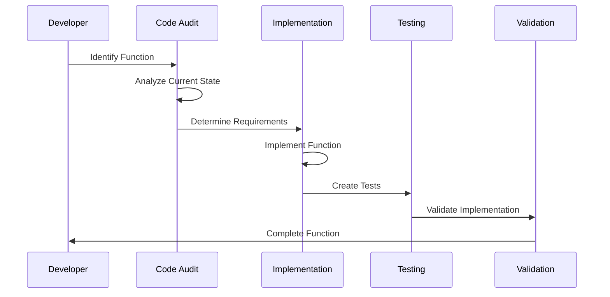

# Design Document - Unimplemented Functions Completion

## Overview

This design document outlines the systematic implementation of all unimplemented, placeholder, stub, and minimal functions identified throughout the Solar System Suite codebase. The design prioritizes critical infrastructure functions first, followed by enhanced features, and finally placeholder implementations, ensuring a stable foundation before adding advanced capabilities.

## Architecture

### Implementation Priority Architecture

```mermaid
graph TB
    subgraph "Priority 1: Critical Infrastructure"
        NET[Network & HTTP Infrastructure]
        ERR[Error Handling & Logging]
        COMP[Data Compression & Archives]
        API[Web Server API Endpoints]
    end

    subgraph "Priority 2: Enhanced Features"
        TEST[Test Framework Infrastructure]
        MOCK[Mock System Integration]
        PERF[Performance Monitoring]
        ALERT[Alerting Systems]
    end

    subgraph "Priority 3: Placeholder Implementations"
        VALID[Data Validation & Recovery]
        INPUT[Input Validation & Security]
        PLAT[Cross-Platform Compatibility]
        REPORT[Reporting & Analytics]
    end

    subgraph "ExiLibraries"
        CORE[solar_core]
        JPL[solar_jpl]
        UTILS[solar_utils]
        TEST_LIB[solar_test]
    end

    NET --> CORE
    ERR --> UTILS
    COMP --> CORE
    API --> CORE

    TEST --> TEST_LIB
    MOCK --> TEST_LIB
    PERF --> UTILS
    ALERT --> TEST_LIB

    VALID --> JPL
    INPUT --> UTILS
    PLAT --> UTILS
    REPORT --> TEST_LIB
```



### Function Implementation Flow



## Components and Interfaces

### 1. Network and HTTP Infrastructure

#### Current State Analysis
- **Location**: `lib/solar_utils/src/network_resource_manager.cpp`
- **Issues**: Uses fake pointers instead of real libcurl, simulated socket operations
- **Impact**: JPL HORIZONS API integration fails, network operations are non-functional

#### Implementation Design

```cpp
class NetworkResourceManager {
private:
    // Real HTTP client implementation
    std::unique_ptr<HttpClient> http_client_;
    std::unique_ptr<SocketManager> socket_manager_;
    std::unique_ptr<DNSResolver> dns_resolver_;

public:
    // HTTP/HTTPS Connection Implementation
    [[nodiscard]] std::unique_ptr<HttpConnection> create_http_connection(
        const std::string& url,
        const HttpOptions& options = {}
    );

    // TCP/UDP Socket Implementation
    [[nodiscard]] std::unique_ptr<Socket> create_socket(
        SocketType type,
        const SocketOptions& options = {}
    );

    // HTTP Request/Response Handling
    [[nodiscard]] HttpResponse send_request(
        const HttpRequest& request,
        std::chrono::milliseconds timeout = std::chrono::seconds(30)
    );

    // Network Data Send/Receive
    [[nodiscard]] size_t send_data(
        const Socket& socket,
        const std::vector<uint8_t>& data
    );

    [[nodiscard]] std::vector<uint8_t> receive_data(
        const Socket& socket,
        size_t max_bytes = 8192
    );

    // Hostname Resolution
    [[nodiscard]] std::vector<std::string> resolve_hostname(
        const std::string& hostname
    );
};

// HTTP Client Implementation using libcurl
class HttpClient {
private:
    CURL* curl_handle_;
    std::unique_ptr<CurlGlobalInit> curl_init_;

public:
    HttpClient();
    ~HttpClient();

    [[nodiscard]] HttpResponse execute_request(
        const HttpRequest& request,
        const HttpOptions& options
    );

private:
    static size_t write_callback(void* contents, size_t size, size_t nmemb, void* userp);
    static size_t header_callback(char* buffer, size_t size, size_t nitems, void* userdata);
};
```

#### Implementation Strategy
1. **Replace fake pointers with real libcurl handles**
2. **Implement proper socket operations using system APIs**
3. **Add comprehensive error handling and retry logic**
4. **Implement connection pooling for efficiency**
5. **Add timeout and cancellation support**

### 2. Error Handling and Logging System

#### Current State Analysis
- **Location**: `lib/solar_utils/src/error_handling.cpp`
- **Issues**: Empty functions, console fallbacks, missing configuration loading
- **Impact**: Poor error diagnostics, no centralized logging, configuration failures

#### Implementation Design

```cpp
class ErrorLogger {
private:
    std::unique_ptr<SyslogHandler> syslog_handler_;
    std::unique_ptr<NetworkLogger> network_logger_;
    std::unique_ptr<MemoryLogger> memory_logger_;
    LoggingConfig config_;

public:
    // Platform-specific syslog integration
    void log_to_syslog(
        LogLevel level,
        const std::string& message,
        const std::string& category = ""
    );

    // Network logging implementation
    void log_to_network(
        LogLevel level,
        const std::string& message,
        const NetworkLogConfig& config
    );

    // Circular buffer memory logging
    void log_to_memory(
        LogLevel level,
        const std::string& message
    );

    // Memory log retrieval
    [[nodiscard]] std::vector<LogEntry> get_memory_logs(
        size_t max_entries = 1000
    ) const;
};

// Memory logging with circular buffer
class MemoryLogger {
private:
    mutable std::mutex mutex_;
    std::vector<LogEntry> log_buffer_;
    size_t buffer_size_;
    size_t current_index_;
    bool buffer_full_;

public:
    explicit MemoryLogger(size_t buffer_size = 10000);

    void add_log_entry(const LogEntry& entry);
    [[nodiscard]] std::vector<LogEntry> get_recent_logs(size_t count) const;
    void clear_logs();
};

// Error handling system configuration
class ErrorHandlingSystem {
private:
    ErrorLogger logger_;
    ErrorConfig config_;
    std::map<std::string, ErrorCode> error_code_map_;

public:
    // Configuration loading implementation
    [[nodiscard]] bool configure(const std::filesystem::path& config_path);

    // Error code lookup implementation
    [[nodiscard]] ErrorCode string_to_error_code(const std::string& error_string) const;

    // Error reporting with context
    void report_error(
        ErrorCode code,
        const std::string& message,
        const ErrorContext& context = {}
    );
};
```

#### Implementation Strategy
1. **Implement platform-specific syslog integration (Unix syslog, Windows Event Log)**
2. **Create network logging using HTTP/UDP protocols**
3. **Implement thread-safe circular buffer for memory logging**
4. **Add configuration file parsing and validation**
5. **Create comprehensive error code mapping system**

### 3. Data Compression and Archive Operations

#### Current State Analysis
- **Location**: `lib/solar_core/src/output/output_formatter.cpp`
- **Issues**: Returns uncompressed data, "not implemented" errors for archives
- **Impact**: No data compression benefits, no archive management capabilities

#### Implementation Design

```cpp
class CompressionManager {
private:
    std::map<CompressionType, std::unique_ptr<CompressionAlgorithm>> algorithms_;

public:
    CompressionManager();

    // Actual compression implementation
    [[nodiscard]] CompressedData compress(
        const std::vector<uint8_t>& data,
        CompressionType type = CompressionType::ZLIB,
        CompressionLevel level = CompressionLevel::BALANCED
    );

    // Actual decompression implementation
    [[nodiscard]] std::vector<uint8_t> decompress(
        const CompressedData& compressed_data
    );

    // Compression ratio analysis
    [[nodiscard]] CompressionStats analyze_compression(
        const std::vector<uint8_t>& data,
        CompressionType type
    ) const;
};

// Archive operations using libarchive
class ArchiveManager {
private:
    std::unique_ptr<ArchiveHandler> archive_handler_;

public:
    // Archive creation implementation
    [[nodiscard]] ArchiveResult create_archive(
        const std::filesystem::path& archive_path,
        const std::vector<std::filesystem::path>& files,
        ArchiveFormat format = ArchiveFormat::TAR_GZ
    );

    // Archive extraction implementation
    [[nodiscard]] ExtractionResult extract_archive(
        const std::filesystem::path& archive_path,
        const std::filesystem::path& destination,
        const ExtractionOptions& options = {}
    );

    // Archive listing implementation
    [[nodiscard]] std::vector<ArchiveEntry> list_archive_contents(
        const std::filesystem::path& archive_path
    );

    // Archive validation
    [[nodiscard]] ValidationResult validate_archive(
        const std::filesystem::path& archive_path
    );
};

// Compression algorithms
class ZlibCompression : public CompressionAlgorithm {
public:
    [[nodiscard]] std::vector<uint8_t> compress(
        const std::vector<uint8_t>& data,
        int level
    ) override;

    [[nodiscard]] std::vector<uint8_t> decompress(
        const std::vector<uint8_t>& compressed_data
    ) override;
};
```

#### Implementation Strategy
1. **Integrate zlib for DEFLATE compression**
2. **Add LZ4 for high-speed compression**
3. **Implement ZSTD for balanced compression**
4. **Use libarchive for TAR, ZIP, and other formats**
5. **Add compression level and format selection**

### 4. Web Server API Endpoints

#### Current State Analysis
- **Location**: `tests/integration/test_web_interface.cpp`
- **Issues**: Returns 404 for all API endpoints, no static file serving
- **Impact**: Web interface non-functional, no programmatic access to data

#### Implementation Design

```cpp
class WebServerAPI {
private:
    std::unique_ptr<HttpServer> server_;
    std::unique_ptr<RouteManager> route_manager_;
    std::unique_ptr<StaticFileHandler> static_handler_;

public:
    // API endpoint implementations
    [[nodiscard]] HttpResponse handle_bodies_endpoint(
        const HttpRequest& request
    );

    [[nodiscard]] HttpResponse handle_simulation_endpoint(
        const HttpRequest& request
    );

    // Static file serving
    [[nodiscard]] HttpResponse serve_static_file(
        const std::filesystem::path& file_path,
        const std::string& mime_type
    );

    // Route registration
    void register_api_routes();

    // Error handling
    [[nodiscard]] HttpResponse handle_404_error(
        const HttpRequest& request
    );
};

// Bodies API endpoint
class BodiesAPIHandler {
public:
    [[nodiscard]] json::object get_all_bodies() const;
    [[nodiscard]] json::object get_body_by_id(int body_id) const;
    [[nodiscard]] json::object get_bodies_by_type(BodyType type) const;
};

// Simulation API endpoint
class SimulationAPIHandler {
private:
    std::shared_ptr<SimulationManager> simulation_manager_;

public:
    [[nodiscard]] json::object get_simulation_state() const;
    [[nodiscard]] json::object start_simulation(const json::object& config);
    [[nodiscard]] json::object stop_simulation();
    [[nodiscard]] json::object get_simulation_results() const;
};

// Static file handler
class StaticFileHandler {
private:
    std::filesystem::path static_root_;
    std::map<std::string, std::string> mime_types_;

public:
    explicit StaticFileHandler(const std::filesystem::path& root);

    [[nodiscard]] HttpResponse serve_file(
        const std::filesystem::path& relative_path
    );

    [[nodiscard]] std::string get_mime_type(
        const std::filesystem::path& file_path
    ) const;

private:
    void initialize_mime_types();
    [[nodiscard]] bool is_safe_path(const std::filesystem::path& path) const;
};
```

#### Implementation Strategy
1. **Implement RESTful API endpoints with proper JSON responses**
2. **Add static file serving with MIME type detection**
3. **Implement proper HTTP status codes and error handling**
4. **Add request validation and sanitization**
5. **Implement caching headers for static content**

### 5. Test Framework Infrastructure

#### Current State Analysis
- **Location**: `lib/solar_test/src/framework/test_runner.cpp`
- **Issues**: Empty stubs, returns hardcoded values, no CI integration
- **Impact**: No CI artifacts, no memory monitoring, no environment detection

#### Implementation Design

```cpp
class TestRunner {
private:
    std::unique_ptr<CIArtifactGenerator> artifact_generator_;
    std::unique_ptr<MemoryMonitor> memory_monitor_;
    std::unique_ptr<EnvironmentDetector> env_detector_;

public:
    // CI artifact generation implementation
    void generate_ci_artifacts(
        const TestResults& results,
        const std::filesystem::path& output_dir
    );

    // Memory usage monitoring implementation
    [[nodiscard]] double get_memory_usage_mb() const;

    // Memory limit checking implementation
    [[nodiscard]] bool is_memory_limit_exceeded(
        double limit_mb
    ) const;

    // Container environment detection
    [[nodiscard]] bool is_running_in_container() const;
    [[nodiscard]] ContainerType get_container_type() const;

    // CI system detection
    [[nodiscard]] CISystem detect_ci_system() const;
};

// CI artifact generation
class CIArtifactGenerator {
public:
    void generate_junit_xml(
        const TestResults& results,
        const std::filesystem::path& output_path
    );

    void generate_coverage_report(
        const CoverageData& coverage,
        const std::filesystem::path& output_path
    );

    void generate_performance_report(
        const PerformanceMetrics& metrics,
        const std::filesystem::path& output_path
    );
};

// Memory monitoring
class MemoryMonitor {
private:
    mutable std::mutex mutex_;
    std::vector<MemorySnapshot> snapshots_;

public:
    [[nodiscard]] MemoryUsage get_current_usage() const;
    [[nodiscard]] MemoryUsage get_peak_usage() const;
    void start_monitoring();
    void stop_monitoring();

private:
    [[nodiscard]] MemoryUsage get_system_memory_usage() const;
    [[nodiscard]] MemoryUsage get_process_memory_usage() const;
};

// Environment detection
class EnvironmentDetector {
public:
    [[nodiscard]] bool is_docker_container() const;
    [[nodiscard]] bool is_kubernetes_pod() const;
    [[nodiscard]] CISystem detect_github_actions() const;
    [[nodiscard]] CISystem detect_jenkins() const;
    [[nodiscard]] CISystem detect_gitlab_ci() const;

private:
    [[nodiscard]] bool check_file_exists(const std::filesystem::path& path) const;
    [[nodiscard]] std::string read_environment_variable(const std::string& name) const;
};
```

#### Implementation Strategy
1. **Implement JUnit XML generation for CI integration**
2. **Add platform-specific memory monitoring (Linux /proc, Windows API)**
3. **Implement container detection using filesystem and environment checks**
4. **Add CI system detection using environment variables**
5. **Create comprehensive test artifact generation**

## Data Models

### Error and Logging Models

```cpp
struct LogEntry {
    std::chrono::system_clock::time_point timestamp;
    LogLevel level;
    std::string category;
    std::string message;
    std::string thread_id;
    std::map<std::string, std::string> context;
};

struct ErrorContext {
    std::string function_name;
    std::string file_name;
    int line_number;
    std::map<std::string, std::string> variables;
    std::vector<std::string> stack_trace;
};

enum class ErrorCode {
    Success = 0,
    NetworkError = 1000,
    CompressionError = 2000,
    ValidationError = 3000,
    ConfigurationError = 4000,
    SecurityError = 5000
};
```

### Compression and Archive Models

```cpp
struct CompressedData {
    CompressionType type;
    CompressionLevel level;
    std::vector<uint8_t> data;
    size_t original_size;
    std::chrono::system_clock::time_point created_at;
};

struct ArchiveEntry {
    std::string name;
    size_t size;
    std::filesystem::file_type type;
    std::filesystem::perms permissions;
    std::chrono::system_clock::time_point modified_time;
};

enum class CompressionType {
    NONE,
    ZLIB,
    LZ4,
    ZSTD,
    GZIP
};
```

### Test Framework Models

```cpp
struct TestResults {
    size_t total_tests;
    size_t passed_tests;
    size_t failed_tests;
    size_t skipped_tests;
    std::chrono::nanoseconds total_duration;
    std::vector<TestCase> test_cases;
};

struct MemoryUsage {
    size_t resident_memory_bytes;
    size_t virtual_memory_bytes;
    size_t peak_memory_bytes;
    double memory_usage_percent;
};

enum class CISystem {
    Unknown,
    GitHubActions,
    Jenkins,
    GitLabCI,
    TravisCI,
    CircleCI,
    AzurePipelines
};
```

## Error Handling

### Comprehensive Error Management Strategy

```cpp
class ErrorManager {
private:
    ErrorLogger logger_;
    std::map<ErrorCode, ErrorHandler> handlers_;

public:
    // Error reporting with automatic classification
    void report_error(
        const std::exception& ex,
        const ErrorContext& context = {}
    );

    // Error recovery strategies
    [[nodiscard]] RecoveryResult attempt_recovery(
        ErrorCode error_code,
        const ErrorContext& context
    );

    // Error pattern analysis
    [[nodiscard]] std::vector<ErrorPattern> analyze_error_patterns(
        std::chrono::hours window = std::chrono::hours(24)
    ) const;
};
```

## Testing Strategy

### Implementation Testing Framework

```cpp
class ImplementationTestSuite {
public:
    // Network infrastructure tests
    [[nodiscard]] TestResult test_http_client_implementation();
    [[nodiscard]] TestResult test_socket_operations();
    [[nodiscard]] TestResult test_dns_resolution();

    // Compression tests
    [[nodiscard]] TestResult test_compression_algorithms();
    [[nodiscard]] TestResult test_archive_operations();

    // Error handling tests
    [[nodiscard]] TestResult test_logging_implementations();
    [[nodiscard]] TestResult test_error_recovery();

    // API endpoint tests
    [[nodiscard]] TestResult test_web_api_endpoints();
    [[nodiscard]] TestResult test_static_file_serving();

    // Integration tests
    [[nodiscard]] TestResult test_end_to_end_workflows();
};
```

### Test Coverage Requirements

1. **Unit Tests**: 100% coverage for all implemented functions
2. **Integration Tests**: All function interactions tested
3. **Performance Tests**: Baseline performance established
4. **Security Tests**: Input validation and error handling
5. **Platform Tests**: Cross-platform compatibility verified

## Implementation Strategy

### Phase 1: Critical Infrastructure (Weeks 1-3)
1. **Network and HTTP Infrastructure**
   - Implement real libcurl HTTP client
   - Add socket operations using system APIs
   - Implement DNS resolution
   - Add comprehensive error handling

2. **Error Handling and Logging**
   - Implement platform-specific syslog integration
   - Add network logging capabilities
   - Create circular buffer memory logging
   - Implement configuration loading

3. **Data Compression and Archives**
   - Integrate zlib, LZ4, and ZSTD compression
   - Implement libarchive integration
   - Add compression level selection
   - Create archive validation

### Phase 2: Enhanced Features (Weeks 4-5)
1. **Web Server API Endpoints**
   - Implement /api/bodies endpoint
   - Add /api/simulation endpoint
   - Create static file serving
   - Add proper HTTP status codes

2. **Test Framework Infrastructure**
   - Implement CI artifact generation
   - Add memory monitoring
   - Create environment detection
   - Add CI system detection

### Phase 3: Placeholder Implementations (Weeks 6-7)
1. **Mock System Integration**
   - Connect JPL mocks to real client
   - Integrate cache mocks with DI system
   - Implement proper date parsing
   - Add network mock loading

2. **Performance Monitoring and Alerting**
   - Implement Windows memory monitoring
   - Add email and Slack alerting
   - Create GitHub issue integration
   - Add streaming data compression

### Phase 4: Validation and Testing (Week 8)
1. **Comprehensive Testing**
   - Unit tests for all implementations
   - Integration tests for workflows
   - Performance regression testing
   - Security vulnerability testing

2. **Documentation and Deployment**
   - Update API documentation
   - Create implementation guides
   - Add troubleshooting documentation
   - Validate deployment procedures

## Quality Assurance

### Implementation Standards
- **Error Handling**: Every function must have comprehensive error handling
- **Performance**: Implementations must meet or exceed placeholder performance
- **Security**: All network and file operations must be secure by default
- **Testing**: 100% test coverage for all implemented functionality
- **Documentation**: Complete API documentation for all public interfaces

### Validation Criteria
- **Functional**: All functions work as specified in requirements
- **Performance**: No performance regressions from current implementations
- **Security**: No security vulnerabilities introduced
- **Compatibility**: Cross-platform compatibility maintained
- **Integration**: All functions integrate properly with existing code
