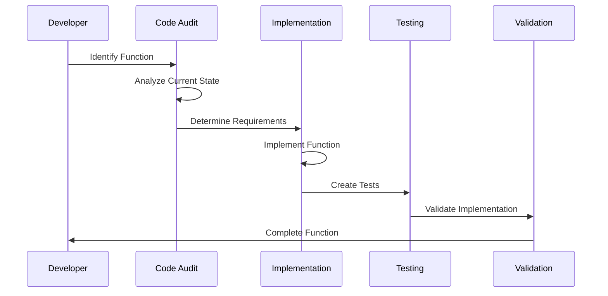

# Design Document - Unimplemented Functions Completion

## Overview

This design document outlines the systematic implementation of all unimplemented, placeholder, stub, and minimal functions identified throughout the Solar System Suite codebase. The design prioritizes critical infrastructure functions first, followed by enhanced features, and finally placeholder implementations, ensuring a stable foundation before adding advanced capabilities.

## Architecture

### Implementation Priority Architecture

```mermaid
graph TB
    subgraph "Priority 1: Critical Infrastructure"
        NET[Network & HTTP Infrastructure]
        ERR[Error Handling & Logging]
        COMP[Data Compression & Archives]
        API[Web Server API Endpoints]
    end

    subgraph "Priority 2: Enhanced Features"
        TEST[Test Framework Infrastructure]
        MOCK[Mock System Integration]
        PERF[Performance Monitoring]
        ALERT[Alerting Systems]
    end

    subgraph "Priority 3: Placeholder Implementations"
        VALID[Data Validation & Recovery]
        INPUT[Input Validation & Security]
        PLAT[Cross-Platform Compatibility]
        REPORT[Reporting & Analytics]
    end

    subgraph "ExiLibraries"
        CORE[solar_core]
        JPL[solar_jpl]
        UTILS[solar_utils]
        TEST_LIB[solar_test]
    end

    NET --> CORE
    ERR --> UTILS
    COMP --> CORE
    API --> CORE

    TEST --> TEST_LIB
    MOCK --> TEST_LIB
    PERF --> UTILS
    ALERT --> TEST_LIB

    VALID --> JPL
    INPUT --> UTILS
    PLAT --> UTILS
    REPORT --> TEST_LIB
```



### Function Implementation Flow



## Components and Interfaces

### 1. Network and HTTP Infrastructure

#### Current State Analysis
- **Location**: `lib/solar_utils/src/network_resource_manager.cpp`
- **Issues**: Uses fake pointers instead of real libcurl, simulated socket operations
- **Impact**: JPL HORIZONS API integration fails, network operations are non-functional

#### Implementation Design

```cpp
class NetworkResourceManager {
private:
    // Real HTTP client implementation
    std::unique_ptr<HttpClient> http_client_;
    std::unique_ptr<SocketManager> socket_manager_;
    std::unique_ptr<DNSResolver> dns_resolver_;

public:
    // HTTP/HTTPS Connection Implementation
    [[nodiscard]] std::unique_ptr<HttpConnection> create_http_connection(
        const std::string& url,
        const HttpOptions& options = {}
    );

    // TCP/UDP Socket Implementation
    [[nodiscard]] std::unique_ptr<Socket> create_socket(
        SocketType type,
        const SocketOptions& options = {}
    );

    // HTTP Request/Response Handling
    [[nodiscard]] HttpResponse send_request(
        const HttpRequest& request,
        std::chrono::milliseconds timeout = std::chrono::seconds(30)
    );

    // Network Data Send/Receive
    [[nodiscard]] size_t send_data(
        const Socket& socket,
        const std::vector<uint8_t>& data
    );

    [[nodiscard]] std::vector<uint8_t> receive_data(
        const Socket& socket,
        size_t max_bytes = 8192
    );

    // Hostname Resolution
    [[nodiscard]] std::vector<std::string> resolve_hostname(
        const std::string& hostname
    );
};

// HTTP Client Implementation using libcurl
class HttpClient {
private:
    CURL* curl_handle_;
    std::unique_ptr<CurlGlobalInit> curl_init_;

public:
    HttpClient();
    ~HttpClient();

    [[nodiscard]] HttpResponse execute_request(
        const HttpRequest& request,
        const HttpOptions& options
    );

private:
    static size_t write_callback(void* contents, size_t size, size_t nmemb, void* userp);
    static size_t header_callback(char* buffer, size_t size, size_t nitems, void* userdata);
};
```

#### Implementation Strategy
1. **Replace fake pointers with real libcurl handles**
2. **Implement proper socket operations using system APIs**
3. **Add comprehensive error handling and retry logic**
4. **Implement connection pooling for efficiency**
5. **Add timeout and cancellation support**

### 2. Error Handling and Logging System

#### Current State Analysis
- **Location**: `lib/solar_utils/src/error_handling.cpp`
- **Issues**: Empty functions, console fallbacks, missing configuration loading
- **Impact**: Poor error diagnostics, no centralized logging, configuration failures

#### Implementation Design

```cpp
class ErrorLogger {
private:
    std::unique_ptr<SyslogHandler> syslog_handler_;
    std::unique_ptr<NetworkLogger> network_logger_;
    std::unique_ptr<MemoryLogger> memory_logger_;
    LoggingConfig config_;

public:
    // Platform-specific syslog integration
    void log_to_syslog(
        LogLevel level,
        const std::string& message,
        const std::string& category = ""
    );

    // Network logging implementation
    void log_to_network(
        LogLevel level,
        const std::string& message,
        const NetworkLogConfig& config
    );

    // Circular buffer memory logging
    void log_to_memory(
        LogLevel level,
        const std::string& message
    );

    // Memory log retrieval
    [[nodiscard]] std::vector<LogEntry> get_memory_logs(
        size_t max_entries = 1000
    ) const;
};

// Memory logging with circular buffer
class MemoryLogger {
private:
    mutable std::mutex mutex_;
    std::vector<LogEntry> log_buffer_;
    size_t buffer_size_;
    size_t current_index_;
    bool buffer_full_;

public:
    explicit MemoryLogger(size_t buffer_size = 10000);

    void add_log_entry(const LogEntry& entry);
    [[nodiscard]] std::vector<LogEntry> get_recent_logs(size_t count) const;
    void clear_logs();
};

// Error handling system configuration
class ErrorHandlingSystem {
private:
    ErrorLogger logger_;
    ErrorConfig config_;
    std::map<std::string, ErrorCode> error_code_map_;

public:
    // Configuration loading implementation
    [[nodiscard]] bool configure(const std::filesystem::path& config_path);

    // Error code lookup implementation
    [[nodiscard]] ErrorCode string_to_error_code(const std::string& error_string) const;

    // Error reporting with context
    void report_error(
        ErrorCode code,
        const std::string& message,
        const ErrorContext& context = {}
    );
};
```

#### Implementation Strategy
1. **Implement platform-specific syslog integration (Unix syslog, Windows Event Log)**
2. **Create network logging using HTTP/UDP protocols**
3. **Implement thread-safe circular buffer for memory logging**
4. **Add configuration file parsing and validation**
5. **Create comprehensive error code mapping system**

### 3. Data Compression and Archive Operations

#### Current State Analysis
- **Location**: `lib/solar_core/src/output/output_formatter.cpp`
- **Issues**: Returns uncompressed data, "not implemented" errors for archives
- **Impact**: No data compression benefits, no archive management capabilities

#### Implementation Design

```cpp
class CompressionManager {
private:
    std::map<CompressionType, std::unique_ptr<CompressionAlgorithm>> algorithms_;

public:
    CompressionManager();

    // Actual compression implementation
    [[nodiscard]] CompressedData compress(
        const std::vector<uint8_t>& data,
        CompressionType type = CompressionType::ZLIB,
        CompressionLevel level = CompressionLevel::BALANCED
    );

    // Actual decompression implementation
    [[nodiscard]] std::vector<uint8_t> decompress(
        const CompressedData& compressed_data
    );

    // Compression ratio analysis
    [[nodiscard]] CompressionStats analyze_compression(
        const std::vector<uint8_t>& data,
        CompressionType type
    ) const;
};

// Archive operations using libarchive
class ArchiveManager {
private:
    std::unique_ptr<ArchiveHandler> archive_handler_;

public:
    // Archive creation implementation
    [[nodiscard]] ArchiveResult create_archive(
        const std::filesystem::path& archive_path,
        const std::vector<std::filesystem::path>& files,
        ArchiveFormat format = ArchiveFormat::TAR_GZ
    );

    // Archive extraction implementation
    [[nodiscard]] ExtractionResult extract_archive(
        const std::filesystem::path& archive_path,
        const std::filesystem::path& destination,
        const ExtractionOptions& options = {}
    );

    // Archive listing implementation
    [[nodiscard]] std::vector<ArchiveEntry> list_archive_contents(
        const std::filesystem::path& archive_path
    );

    // Archive validation
    [[nodiscard]] ValidationResult validate_archive(
        const std::filesystem::path& archive_path
    );
};

// Compression algorithms
class ZlibCompression : public CompressionAlgorithm {
public:
    [[nodiscard]] std::vector<uint8_t> compress(
        const std::vector<uint8_t>& data,
        int level
    ) override;

    [[nodiscard]] std::vector<uint8_t> decompress(
        const std::vector<uint8_t>& compressed_data
    ) override;
};
```

#### Implementation Strategy
1. **Integrate zlib for DEFLATE compression**
2. **Add LZ4 for high-speed compression**
3. **Implement ZSTD for balanced compression**
4. **Use libarchive for TAR, ZIP, and other formats**
5. **Add compression level and format selection**

### 4. Web Server API Endpoints

#### Current State Analysis
- **Location**: `tests/integration/test_web_interface.cpp`
- **Issues**: Returns 404 for all API endpoints, no static file serving
- **Impact**: Web interface non-functional, no programmatic access to data

#### Implementation Design

```cpp
class WebServerAPI {
private:
    std::unique_ptr<HttpServer> server_;
    std::unique_ptr<RouteManager> route_manager_;
    std::unique_ptr<StaticFileHandler> static_handler_;

public:
    // API endpoint implementations
    [[nodiscard]] HttpResponse handle_bodies_endpoint(
        const HttpRequest& request
    );

    [[nodiscard]] HttpResponse handle_simulation_endpoint(
        const HttpRequest& request
    );

    // Static file serving
    [[nodiscard]] HttpResponse serve_static_file(
        const std::filesystem::path& file_path,
        const std::string& mime_type
    );

    // Route registration
    void register_api_routes();

    // Error handling
    [[nodiscard]] HttpResponse handle_404_error(
        const HttpRequest& request
    );
};

// Bodies API endpoint
class BodiesAPIHandler {
public:
    [[nodiscard]] json::object get_all_bodies() const;
    [[nodiscard]] json::object get_body_by_id(int body_id) const;
    [[nodiscard]] json::object get_bodies_by_type(BodyType type) const;
};

// Simulation API endpoint
class SimulationAPIHandler {
private:
    std::shared_ptr<SimulationManager> simulation_manager_;

public:
    [[nodiscard]] json::object get_simulation_state() const;
    [[nodiscard]] json::object start_simulation(const json::object& config);
    [[nodiscard]] json::object stop_simulation();
    [[nodiscard]] json::object get_simulation_results() const;
};

// Static file handler
class StaticFileHandler {
private:
    std::filesystem::path static_root_;
    std::map<std::string, std::string> mime_types_;

public:
    explicit StaticFileHandler(const std::filesystem::path& root);

    [[nodiscard]] HttpResponse serve_file(
        const std::filesystem::path& relative_path
    );

    [[nodiscard]] std::string get_mime_type(
        const std::filesystem::path& file_path
    ) const;

private:
    void initialize_mime_types();
    [[nodiscard]] bool is_safe_path(const std::filesystem::path& path) const;
};
```

#### Implementation Strategy
1. **Implement RESTful API endpoints with proper JSON responses**
2. **Add static file serving with MIME type detection**
3. **Implement proper HTTP status codes and error handling**
4. **Add request validation and sanitization**
5. **Implement caching headers for static content**

### 5. Test Framework Infrastructure

#### Current State Analysis
- **Location**: `lib/solar_test/src/framework/test_runner.cpp`
- **Issues**: Empty stubs, returns hardcoded values, no CI integration
- **Impact**: No CI artifacts, no memory monitoring, no environment detection

#### Implementation Design

```cpp
class TestRunner {
private:
    std::unique_ptr<CIArtifactGenerator> artifact_generator_;
    std::unique_ptr<MemoryMonitor> memory_monitor_;
    std::unique_ptr<EnvironmentDetector> env_detector_;

public:
    // CI artifact generation implementation
    void generate_ci_artifacts(
        const TestResults& results,
        const std::filesystem::path& output_dir
    );

    // Memory usage monitoring implementation
    [[nodiscard]] double get_memory_usage_mb() const;

    // Memory limit checking implementation
    [[nodiscard]] bool is_memory_limit_exceeded(
        double limit_mb
    ) const;

    // Container environment detection
    [[nodiscard]] bool is_running_in_container() const;
    [[nodiscard]] ContainerType get_container_type() const;

    // CI system detection
    [[nodiscard]] CISystem detect_ci_system() const;
};

// CI artifact generation
class CIArtifactGenerator {
public:
    void generate_junit_xml(
        const TestResults& results,
        const std::filesystem::path& output_path
    );

    void generate_coverage_report(
        const CoverageData& coverage,
        const std::filesystem::path& output_path
    );

    void generate_performance_report(
        const PerformanceMetrics& metrics,
        const std::filesystem::path& output_path
    );
};

// Memory monitoring
class MemoryMonitor {
private:
    mutable std::mutex mutex_;
    std::vector<MemorySnapshot> snapshots_;

public:
    [[nodiscard]] MemoryUsage get_current_usage() const;
    [[nodiscard]] MemoryUsage get_peak_usage() const;
    void start_monitoring();
    void stop_monitoring();

private:
    [[nodiscard]] MemoryUsage get_system_memory_usage() const;
    [[nodiscard]] MemoryUsage get_process_memory_usage() const;
};

// Environment detection
class EnvironmentDetector {
public:
    [[nodiscard]] bool is_docker_container() const;
    [[nodiscard]] bool is_kubernetes_pod() const;
    [[nodiscard]] CISystem detect_github_actions() const;
    [[nodiscard]] CISystem detect_jenkins() const;
    [[nodiscard]] CISystem detect_gitlab_ci() const;

private:
    [[nodiscard]] bool check_file_exists(const std::filesystem::path& path) const;
    [[nodiscard]] std::string read_environment_variable(const std::string& name) const;
};
```

#### Implementation Strategy
1. **Implement JUnit XML generation for CI integration**
2. **Add platform-specific memory monitoring (Linux /proc, Windows API)**
3. **Implement container detection using filesystem and environment checks**
4. **Add CI system detection using environment variables**
5. **Create comprehensive test artifact generation**

## Data Models

### Error and Logging Models

```cpp
struct LogEntry {
    std::chrono::system_clock::time_point timestamp;
    LogLevel level;
    std::string category;
    std::string message;
    std::string thread_id;
    std::map<std::string, std::string> context;
};

struct ErrorContext {
    std::string function_name;
    std::string file_name;
    int line_number;
    std::map<std::string, std::string> variables;
    std::vector<std::string> stack_trace;
};

enum class ErrorCode {
    Success = 0,
    NetworkError = 1000,
    CompressionError = 2000,
    ValidationError = 3000,
    ConfigurationError = 4000,
    SecurityError = 5000
};
```

### Compression and Archive Models

```cpp
struct CompressedData {
    CompressionType type;
    CompressionLevel level;
    std::vector<uint8_t> data;
    size_t original_size;
    std::chrono::system_clock::time_point created_at;
};

struct ArchiveEntry {
    std::string name;
    size_t size;
    std::filesystem::file_type type;
    std::filesystem::perms permissions;
    std::chrono::system_clock::time_point modified_time;
};

enum class CompressionType {
    NONE,
    ZLIB,
    LZ4,
    ZSTD,
    GZIP
};
```

### Test Framework Models

```cpp
struct TestResults {
    size_t total_tests;
    size_t passed_tests;
    size_t failed_tests;
    size_t skipped_tests;
    std::chrono::nanoseconds total_duration;
    std::vector<TestCase> test_cases;
};

struct MemoryUsage {
    size_t resident_memory_bytes;
    size_t virtual_memory_bytes;
    size_t peak_memory_bytes;
    double memory_usage_percent;
};

enum class CISystem {
    Unknown,
    GitHubActions,
    Jenkins,
    GitLabCI,
    TravisCI,
    CircleCI,
    AzurePipelines
};
```

## Error Handling

### Comprehensive Error Management Strategy

```cpp
class ErrorManager {
private:
    ErrorLogger logger_;
    std::map<ErrorCode, ErrorHandler> handlers_;

public:
    // Error reporting with automatic classification
    void report_error(
        const std::exception& ex,
        const ErrorContext& context = {}
    );

    // Error recovery strategies
    [[nodiscard]] RecoveryResult attempt_recovery(
        ErrorCode error_code,
        const ErrorContext& context
    );

    // Error pattern analysis
    [[nodiscard]] std::vector<ErrorPattern> analyze_error_patterns(
        std::chrono::hours window = std::chrono::hours(24)
    ) const;
};
```

## Testing Strategy

### Implementation Testing Framework

```cpp
class ImplementationTestSuite {
public:
    // Network infrastructure tests
    [[nodiscard]] TestResult test_http_client_implementation();
    [[nodiscard]] TestResult test_socket_operations();
    [[nodiscard]] TestResult test_dns_resolution();

    // Compression tests
    [[nodiscard]] TestResult test_compression_algorithms();
    [[nodiscard]] TestResult test_archive_operations();

    // Error handling tests
    [[nodiscard]] TestResult test_logging_implementations();
    [[nodiscard]] TestResult test_error_recovery();

    // API endpoint tests
    [[nodiscard]] TestResult test_web_api_endpoints();
    [[nodiscard]] TestResult test_static_file_serving();

    // Integration tests
    [[nodiscard]] TestResult test_end_to_end_workflows();
};
```

### Test Coverage Requirements

1. **Unit Tests**: 100% coverage for all implemented functions
2. **Integration Tests**: All function interactions tested
3. **Performance Tests**: Baseline performance established
4. **Security Tests**: Input validation and error handling
5. **Platform Tests**: Cross-platform compatibility verified

## Implementation Strategy

### Phase 1: Critical Infrastructure (Weeks 1-3)
1. **Network and HTTP Infrastructure**
   - Implement real libcurl HTTP client
   - Add socket operations using system APIs
   - Implement DNS resolution
   - Add comprehensive error handling

2. **Error Handling and Logging**
   - Implement platform-specific syslog integration
   - Add network logging capabilities
   - Create circular buffer memory logging
   - Implement configuration loading

3. **Data Compression and Archives**
   - Integrate zlib, LZ4, and ZSTD compression
   - Implement libarchive integration
   - Add compression level selection
   - Create archive validation

### Phase 2: Enhanced Features (Weeks 4-5)
1. **Web Server API Endpoints**
   - Implement /api/bodies endpoint
   - Add /api/simulation endpoint
   - Create static file serving
   - Add proper HTTP status codes

2. **Test Framework Infrastructure**
   - Implement CI artifact generation
   - Add memory monitoring
   - Create environment detection
   - Add CI system detection

### Phase 3: Placeholder Implementations (Weeks 6-7)
1. **Mock System Integration**
   - Connect JPL mocks to real client
   - Integrate cache mocks with DI system
   - Implement proper date parsing
   - Add network mock loading

2. **Performance Monitoring and Alerting**
   - Implement Windows memory monitoring
   - Add email and Slack alerting
   - Create GitHub issue integration
   - Add streaming data compression

### Phase 4: Validation and Testing (Week 8)
1. **Comprehensive Testing**
   - Unit tests for all implementations
   - Integration tests for workflows
   - Performance regression testing
   - Security vulnerability testing

2. **Documentation and Deployment**
   - Update API documentation
   - Create implementation guides
   - Add troubleshooting documentation
   - Validate deployment procedures

## Quality Assurance

### Implementation Standards
- **Error Handling**: Every function must have comprehensive error handling
- **Performance**: Implementations must meet or exceed placeholder performance
- **Security**: All network and file operations must be secure by default
- **Testing**: 100% test coverage for all implemented functionality
- **Documentation**: Complete API documentation for all public interfaces

### Validation Criteria
- **Functional**: All functions work as specified in requirements
- **Performance**: No performance regressions from current implementations
- **Security**: No security vulnerabilities introduced
- **Compatibility**: Cross-platform compatibility maintained
- **Integration**: All functions integrate properly with existing code


## Application Enhancement Functions (Phase 3.5)

### Overview

This phase addresses simplified and mock implementations discovered during the Application Enhancements spec (Tasks 11-19). These functions are currently functional for testing but require production-ready implementations for real-world use.

**Source**: `.kiro/specs/application-enhancements/UNIMPLEMENTED_FUNCTIONS.md`
**Total Functions**: 27 identified functions across 6 files
**Priority**: HIGH for serialization, MEDIUM for quality assessment, LOW for visualization/config

### 6. Data Sharing Template Serialization

#### Current State Analysis
- **Location**: `lib/solar_core/include/solar_core/data/shared_data_manager.hpp`
- **Issues**: Template methods return mock data, no actual serialization
- **Impact**: Cannot store/retrieve typed data in production

#### Implementation Design

```cpp
// Serialization strategy using nlohmann/json
template <typename T>
class JsonSerializer {
public:
    [[nodiscard]] static std::string serialize(const T& value) {
        nlohmann::json j = value;  // Requires to_json() overload
        return j.dump();
    }

    [[nodiscard]] static T deserialize(const std::string& json_str) {
        nlohmann::json j = nlohmann::json::parse(json_str);
        return j.get<T>();  // Requires from_json() overload
    }
};

// Updated SharedDataManager implementation
template <typename T>
SolarSystem::Utils::Expected<DataVersion, std::string>
SharedDataManager::store(const std::string& key, const T& value, const std::string& owner) {
    std::lock_guard<std::mutex> lock(impl_->mutex);

    try {
        // Serialize value to string
        std::string serialized = JsonSerializer<T>::serialize(value);

        // Store in internal map
        impl_->data_store[key] = serialized;

        // Create version
        DataVersion version;
        version.version = impl_->next_version++;
        version.timestamp = std::chrono::system_clock::now();
        version.modified_by = owner;

        impl_->versions[key] = version;
        impl_->stats.total_entries = impl_->data_store.size();
        impl_->stats.total_writes++;

        return SolarSystem::Utils::Expected<DataVersion, std::string>(version);
    } catch (const std::exception& ex) {
        return SolarSystem::Utils::Expected<DataVersion, std::string>(
            std::string("Serialization failed: ") + ex.what());
    }
}

template <typename T>
std::optional<SharedDataEntry<T>>
SharedDataManager::retrieve(const std::string& key) {
    std::lock_guard<std::mutex> lock(impl_->mutex);

    auto it = impl_->data_store.find(key);
    if (it == impl_->data_store.end()) {
        impl_->stats.total_reads++;
        return std::nullopt;
    }

    try {
        SharedDataEntry<T> entry;
        entry.key = key;
        entry.value = JsonSerializer<T>::deserialize(it->second);

        auto version_it = impl_->versions.find(key);
        if (version_it != impl_->versions.end()) {
            entry.version = version_it->second;
        }

        impl_->stats.total_reads++;
        return entry;
    } catch (const std::exception& ex) {
        impl_->stats.total_reads++;
        return std::nullopt;
    }
}

// DistributedCache implementation with TTL
template <typename T>
void DistributedCache::cache(const std::string& key, const T& value,
                             std::chrono::seconds ttl) {
    std::lock_guard<std::mutex> lock(impl_->mutex);

    try {
        std::string serialized = JsonSerializer<T>::serialize(value);
        impl_->cache_store[key] = serialized;
        impl_->expiry[key] = std::chrono::system_clock::now() + ttl;
        impl_->stats.total_entries = impl_->cache_store.size();
    } catch (const std::exception&) {
        // Log error but don't throw
    }
}

template <typename T>
std::optional<T> DistributedCache::get(const std::string& key) {
    std::lock_guard<std::mutex> lock(impl_->mutex);

    auto it = impl_->cache_store.find(key);
    if (it == impl_->cache_store.end
       impl_->stats.misses++;
        return std::nullopt;
    }

    // Check TTL
    auto expiry_it = impl_->expiry.find(key);
    if (expiry_it != impl_->expiry.end()) {
        if (std::chrono::system_clock::now() > expiry_it->second) {
            // Expired
            impl_->cache_store.erase(it);
            impl_->expiry.erase(expiry_it);
            impl_->stats.misses++;
            return std::nullopt;
        }
    }

    try {
        T value = JsonSerializer<T>::deserialize(it->second);
        impl_->stats.hits++;
        return value;
    } catch (const std::exception&) {
        impl_->stats.misses++;
        return std::nullopt;
    }
}
```

#### Implementation Strategy
1. **Integrate nlohmann/json library for JSON serialization**
2. **Implement to_json/from_json overloads for common types**
3. **Add proper error handling for serialization failures**
4. **Implement TTL checking in DistributedCache**
5. **Add statistics tracking for cache hits/misses**

### 7. Message Serialization Implementation

#### Current State Analysis
- **Location**: `lib/solar_core/src/communication/message.cpp`
- **Issues**: Returns hardcoded strings, no actual serialization
- **Impact**: Inter-application communication non-functional

#### Implementation Design

```cpp
// JSON Message Serializer using nlohmann/json
class JsonMessageSerializer : public MessageSerializer {
public:
    [[nodiscard]] SolarSystem::Utils::Expected<std::vector<uint8_t>, SerializationError>
    serialize(const Message& message) const override {
        try {
            nlohmann::json j;

            // Serialize header
            j["header"]["message_id"] = message.header.message_id;
            j["header"]["type"] = static_cast<int>(message.header.type);
            j["header"]["priority"] = static_cast<int>(message.header.priority);
            j["header"]["source"] = message.header.source_application;
            j["header"]["destination"] = message.header.destination_application;
            j["header"]["timestamp"] = std::chrono::system_clock::to_time_t(message.header.timestamp);

            if (message.header.correlation_id) {
                j["header"]["correlation_id"] = *message.header.correlation_id;
            }

            // Serialize metadata
            j["metadata"] = message.header.metadata;

            // Serialize payload
            nlohmann::json payload_json;
            for (const auto& [key, value] : message.payload) {
                if (std::holds_alternative<std::string>(value)) {
                    payload_json[key] = std::get<std::string>(value);
                } else if (std::holds_alternative<int64_t>(value)) {
                    payload_json[key] = std::get<int64_t>(value);
                } else if (std::holds_alternative<double>(value)) {
                    payload_json[key] = std::get<double>(value);
                } else if (std::holds_alternative<bool>(value)) {
                    payload_json[key] = std::get<bool>(value);
                }
                // Add more types as needed
            }
            j["payload"] = payload_json;

            std::string json_str = j.dump();
            return std::vector<uint8_t>(json_str.begin(), json_str.end());

        } catch (const std::exception& ex) {
            SerializationError error;
            error.code = SerializationErrorCode::SERIALIZATION_FAILED;
            error.message = std::string("JSON serialization failed: ") + ex.what();
            return SolarSystem::Utils::Expected<std::vector<uint8_t>, SerializationError>(error);
        }
    }

    [[nodiscard]] SolarSystem::Utils::Expected<Message, SerializationError>
    deserialize(const std::vector<uint8_t>& data) const override {
        try {
            std::string json_str(data.begin(), data.end());
            nlohmann::json j = nlohmann::json::parse(json_str);

            Message msg;

            // Deserialize header
            msg.header.message_id = j["header"]["message_id"];
            msg.header.type = static_cast<MessageType>(j["header"]["type"].get<int>());
            msg.header.priority = static_cast<MessagePriority>(j["header"]["priority"].get<int>());
            msg.header.source_application = j["header"]["source"];
            msg.header.destination_application = j["header"]["destination"];

            if (j["header"].contains("correlation_id")) {
                msg.header.correlation_id = j["header"]["correlation_id"];
            }

            // Deserialize metadata
            msg.header.metadata = j["metadata"].get<std::map<std::string, std::string>>();

            // Deserialize payload
            for (auto& [key, value] : j["payload"].items()) {
                if (value.is_string()) {
                    msg.payload[key] = value.get<std::string>();
                } else if (value.is_number_integer()) {
                    msg.payload[key] = value.get<int64_t>();
                } else if (value.is_number_float()) {
                    msg.payload[key] = value.get<double>();
                } else if (value.is_boolean()) {
                    msg.payload[key] = value.get<bool>();
                }
            }

            return SolarSystem::Utils::Expected<Message, SerializationError>(msg);

        } catch (const std::exception& ex) {
            SerializationError error;
            error.code = SerializationErrorCode::DESERIALIZATION_FAILED;
            error.message = std::string("JSON deserialization failed: ") + ex.what();
            return SolarSystem::Utils::Expected<Message, SerializationError>(error);
        }
    }
};

// Binary Message Serializer using MessagePack
class BinaryMessageSerializer : public MessageSerializer {
public:
    [[nodiscard]] SolarSystem::Utils::Expected<std::vector<uint8_t>, SerializationError>
    serialize(const Message& message) const override {
        try {
            // Use MessagePack for efficient binary serialization
            msgpack::sbuffer buffer;
            msgpack::packer<msgpack::sbuffer> packer(buffer);

            // Pack message structure
            packer.pack_map(3);  // header, metadata, payload

            // Pack header
            packer.pack(std::string("header"));
            pack_header(packer, message.header);

            // Pack metadata
            packer.pack(std::string("metadata"));
            packer.pack(message.header.metadata);

            // Pack payload
            packer.pack(std::string("payload"));
            pack_payload(packer, message.payload);

            return std::vector<uint8_t>(buffer.data(), buffer.data() + buffer.size());

        } catch (const std::exception& ex) {
            SerializationError error;
            error.code = SerializationErrorCode::SERIALIZATION_FAILED;
            error.message = std::string("Binary serialization failed: ") + ex.what();
            return SolarSystem::Utils::Expected<std::vector<uint8_t>, SerializationError>(error);
        }
    }

    // Deserialization implementation similar to above
};
```

#### Implementation Strategy
1. **Integrate nlohmann/json for JSON serialization**
2. **Integrate MessagePack for binary serialization**
3. **Implement proper error handling for parse failures**
4. **Add support for all MessageValue variant types**
5. **Implement accurate size estimation**

### 8. Quality Assessment Implementation

#### Current State Analysis
- **Location**: `lib/solar_core/src/streaming/quality_monitor.cpp`
- **Issues**: Simplified calculations, all metrics set to overall_score
- **Impact**: Quality metrics don't reflect actual data characteristics

#### Implementation Design

```cpp
class QualityMonitor {
private:
    // Statistical helper functions
    [[nodiscard]] double calculate_z_score(double value, double mean, double std_dev) const;
    [[nodiscard]] bool is_outlier_iqr(double value, const std::vector<double>& data) const;
    [[nodiscard]] double calculate_linear_regression_slope(
        const std::vector<std::pair<double, double>>& points) const;

public:
    // Enhanced quality assessment
    [[nodiscard]] double calculate_data_freshness(const DataPoint& data_point) const {
        auto now = std::chrono::system_clock::now();
        auto age = std::chrono::duration_cast<std::chrono::seconds>(now - data_point.timestamp);

        // Consider multiple factors
        double age_score = 1.0 - std::min(1.0, age.count() / config_.max_data_age.count());
        double latency_score = 1.0 - std::min(1.0, data_point.latency.count() / 1000.0);

        // Check update frequency
        double frequency_score = 1.0;
        if (config_.expected_update_frequency > std::chrono::seconds(0)) {
            auto expected_age = config_.expected_update_frequency;
            frequency_score = 1.0 - std::min(1.0, age.count() / expected_age.count());
        }

        // Weighted combination
        return (age_score * 0.4) + (latency_score * 0.3) + (frequency_score * 0.3);
    }

    [[nodiscard]] double calculate_data_accuracy(const DataPoint& data_point) const {
        double score = 1.0;

        // Check for invalid values
        if (std::isnan(data_point.position.x) || std::isnan(data_point.position.y) ||
            std::isnan(data_point.position.z)) {
            score -= 0.5;
        }

        // Check against expected ranges
        double distance = std::sqrt(
            data_point.position.x * data_point.position.x +
            data_point.position.y * data_point.position.y +
            data_point.position.z * data_point.position.z
        );

        if (distance < config_.min_expected_distance || distance > config_.max_expected_distance) {
            score -= 0.3;
        }

        // Compare with historical data
        auto history = get_body_history(data_point.body_name);
        if (!history.empty()) {
            // Check if current value is within reasonable range of historical values
            double historical_mean = calculate_mean(history);
            double historical_std = calculate_std_dev(history);

            double z_score = calculate_z_score(distance, historical_mean, historical_std);
            if (std::abs(z_score) > 3.0) {  // More than 3 standard deviations
                score -= 0.2;
            }
        }

        return std::max(0.0, score);
    }

    [[nodiscard]] double calculate_data_completeness(const DataPoint& data_point) const {
        int total_fields = 10;  // Expected number of fields
        int present_fields = 0;

        // Check all required fields
        if (!data_point.body_name.empty()) present_fields++;
        if (data_point.timestamp != std::chrono::system_clock::time_point{}) present_fields++;
        if (!std::isnan(data_point.position.x)) present_fields++;
        if (!std::isnan(data_point.position.y)) present_fields++;
        if (!std::isnan(data_point.position.z)) present_fields++;
        if (!std::isnan(data_point.velocity.x)) present_fields++;
        if (!std::isnan(data_point.velocity.y)) present_fields++;
        if (!std::isnan(data_point.velocity.z)) present_fields++;
        if (!data_point.data_source.empty()) present_fields++;
        if (data_point.latency.count() >= 0) present_fields++;

        return static_cast<double>(present_fields) / total_fields;
    }

    [[nodiscard]] double calculate_data_consistency(const DataPoint& data_point) const {
        double score = 1.0;

        // Cross-validate with other data sources if available
        auto other_sources = get_data_from_other_sources(data_point.body_name);

        for (const auto& other : other_sources) {
            // Check position consistency
            double position_diff = calculate_distance(data_point.position, other.position);
            if (position_diff > config_.max_position_difference) {
                score -= 0.2;
            }

            // Check velocity consistency
            double velocity_diff = calculate_distance(data_point.velocity, other.velocity);
            if (velocity_diff > config_.max_velocity_difference) {
                score -= 0.2;
            }
        }

        return std::max(0.0, score);
    }

    [[nodiscard]] bool detect_anomaly(const DataPoint& data_point) const {
        auto history = get_body_history(data_point.body_name);
        if (history.size() < config_.min_history_for_anomaly_detection) {
            return false;
        }

        // Extract values for statistical analysis
        std::vector<double> distances;
        for (const auto& point : history) {
            double dist = std::sqrt(
                point.position.x * point.position.x +
                point.position.y * point.position.y +
                point.position.z * point.position.z
            );
            distances.push_back(dist);
        }

        double current_distance = std::sqrt(
            data_point.position.x * data_point.position.x +
            data_point.position.y * data_point.position.y +
            data_point.position.z * data_point.position.z
        );

        // Z-score method
        double mean = calculate_mean(distances);
        double std_dev = calculate_std_dev(distances);
        double z_score = calculate_z_score(current_distance, mean, std_dev);

        if (std::abs(z_score) > config_.anomaly_z_score_threshold) {
            return true;
        }

        // IQR method
        if (is_outlier_iqr(current_distance, distances)) {
            return true;
        }

        return false;
    }
};
```

#### Implementation Strategy
1. **Implement proper statistical functions (mean, std dev, Z-score)**
2. **Add IQR-based outlier detection**
3. **Implement linear regression for trend analysis**
4. **Add cross-source validation for consistency**
5. **Implement configurable thresholds for all metrics**

### Implementation Priority

**Phase 3.5 Priority Order:**
1. **Week 1**: Message Serialization (Task 10.5) - HIGH priority, blocks communication
2. **Week 1-2**: Data Sharing Templates (Task 10.4) - HIGH priority, blocks data sharing
3. **Week 2**: Communication Protocol (Task 10.6) - MEDIUM priority, improves efficiency
4. **Week 3**: Quality Assessment (Task 10.7) - MEDIUM priority, improves monitoring
5. **Week 3**: Statistical Aggregation (Task 10.8) - MEDIUM priority, improves analysis
6. **Week 4**: Review and implement remaining functions (Tasks 10.9-10.11) - LOW priority

### Testing Strategy for Application Enhancement Functions

```cpp
class ApplicationEnhancementTests {
public:
    // Serialization tests
    [[nodiscard]] TestResult test_data_sharing_serialization();
    [[nodiscard]] TestResult test_message_json_serialization();
    [[nodiscard]] TestResult test_message_binary_serialization();

    // Quality assessment tests
    [[nodiscard]] TestResult test_quality_metrics_calculation();
    [[nodiscard]] TestResult test_anomaly_detection();
    [[nodiscard]] TestResult test_statistical_aggregation();

    // Integration tests
    [[nodiscard]] TestResult test_end_to_end_data_sharing();
    [[nodiscard]] TestResult test_end_to_end_communication();
    [[nodiscard]] TestResult test_end_to_end_quality_monitoring();
};
```


### 9. Distributed Workflow Execution (Task 20)

#### Current State Analysis
- **Location**: `lib/solar_core/src/workflow/workflow_coordinator.cpp` (Lines 243-261)
- **Issues**: Executes workflows locally only, no true distributed execution
- **Impact**: Cannot leverage multiple nodes for parallel workflow execution

#### Implementation Design

```cpp
// Distributed workflow execution using gRPC
class DistributedWorkflowExecutor {
private:
    std::unique_ptr<NodeCommunicator> node_communicator_;
    std::unique_ptr<LoadBalancer> load_balancer_;
    std::unique_ptr<CoordinationService> coordinator_;

public:
    [[nodiscard]] SolarSystem::Utils::Expected<void, std::string> execute_distributed(
        std::shared_ptr<WorkflowTransaction> transaction,
        const std::vector<std::string>& node_ids) {

        // 1. Serialize transaction steps
        auto serialized = serialize_transaction(transaction);

        // 2. Create distribution plan
        auto plan = load_balancer_->create_plan(serialized, node_ids);

        // 3. Execute on remote nodes
        std::vector<std::future<StepResult>> futures;
        for (const auto& [node_id, steps] : plan) {
            futures.push_back(
                node_communicator_->execute_remote(node_id, steps)
            );
        }

        // 4. Aggregate results with error handling
        std::vector<StepResult> results;
        for (auto& future : futures) {
            try {
                results.push_back(future.get());
            } catch (const NodeFailureException& ex) {
                // Retry on different node
                auto retry_result = handle_node_failure(ex);
                if (!retry_result) {
                    return retry_result;
                }
                results.push_back(*retry_result);
            }
        }

        // 5. Update transaction with results
        return update_transaction(transaction, results);
    }
};

// Node communication using gRPC
class NodeCommunicator {
private:
    std::map<std::string, std::unique_ptr<grpc::Channel>> channels_;

public:
    [[nodiscard]] std::future<StepResult> execute_remote(
        const std::string& node_id,
        const SerializedSteps& steps) {

        return std::async(std::launch::async, [this, node_id, steps]() {
            auto channel = get_or_create_channel(node_id);
            auto stub = WorkflowService::NewStub(channel);

            grpc::ClientContext context;
            ExecuteRequest request;
            request.set_steps(steps.data(), steps.size());

            ExecuteResponse response;
            auto status = stub->Execute(&context, request, &response);

            if (!status.ok()) {
                throw NodeFailureException(node_id, status.error_message());
            }

            return deserialize_result(response);
        });
    }
};

// Load balancing
class LoadBalancer {
public:
    [[nodiscard]] DistributionPlan create_plan(
        const SerializedTransaction& transaction,
        const std::vector<std::string>& node_ids) {

        DistributionPlan plan;

        // Get node capabilities and current load
        std::vector<NodeInfo> nodes;
        for (const auto& node_id : node_ids) {
            nodes.push_back(get_node_info(node_id));
        }

        // Sort by available capacity
        std::sort(nodes.begin(), nodes.end(),
            [](const NodeInfo& a, const NodeInfo& b) {
                return a.available_capacity > b.available_capacity;
            });

        // Distribute steps using round-robin with capacity awareness
        size_t node_idx = 0;
        for (const auto& step : transaction.steps) {
            plan[nodes[node_idx].id].push_back(step);
            node_idx = (node_idx + 1) % nodes.size();
        }

        return plan;
    }
};

// Coordination using Raft consensus
class CoordinationService {
private:
    std::unique_ptr<RaftNode> raft_node_;

public:
    [[nodiscard]] bool is_leader() const {
        return raft_node_->is_leader();
    }

    [[nodiscard]] std::string get_leader_id() const {
        return raft_node_->get_leader_id();
    }

    void coordinate_execution(const std::string& transaction_id) {
        if (!is_leader()) {
            // Forward to leader
            forward_to_leader(transaction_id);
            return;
        }

        // Leader coordinates execution
        execute_as_leader(transaction_id);
    }
};
```

#### Implementation Strategy
1. **Integrate gRPC for node communication**
   - Define Protocol Buffer messages for transaction serialization
   - Implement gRPC service for remote execution
   - Add connection pooling and health checking

2. **Implement load balancing**
   - Track node capabilities and current load
   - Distribute work based on capacity
   - Implement work stealing for dynamic rebalancing

3. **Add fault tolerance**
   - Implement automatic retry on node failure
   - Add health checking and heartbeats
   - Implement graceful degradation

4. **Implement coordination**
   - Use Raft for leader election
   - Coordinate distributed transactions
   - Handle split-brain scenarios

5. **Add monitoring and debugging**
   - Track execution across nodes
   - Aggregate logs from distributed execution
   - Provide distributed tracing

#### Testing Strategy

```cpp
class DistributedWorkflowTests {
public:
    // Multi-node execution tests
    [[nodiscard]] TestResult test_two_node_execution();
    [[nodiscard]] TestResult test_multi_node_execution();

    // Failure handling tests
    [[nodiscard]] TestResult test_node_failure_retry();
    [[nodiscard]] TestResult test_network_partition();
    [[nodiscard]] TestResult test_leader_failure();

    // Load balancing tests
    [[nodiscard]] TestResult test_even_distribution();
    [[nodiscard]] TestResult test_capacity_aware_distribution();
    [[nodiscard]] TestResult test_work_stealing();

    // Performance tests
    [[nodiscard]] TestResult test_parallel_speedup();
    [[nodiscard]] TestResult test_scalability();
};
```

#### Priority: LOW

**Rationale:**
- Core workflow functionality is complete and production-ready
- Single-node execution handles most use cases
- Distributed execution is an advanced scalability feature
- Requires significant infrastructure (gRPC, Protocol Buffers, Raft)
- Can be added later without breaking existing API
- Current framework provides foundation for future distributed execution
